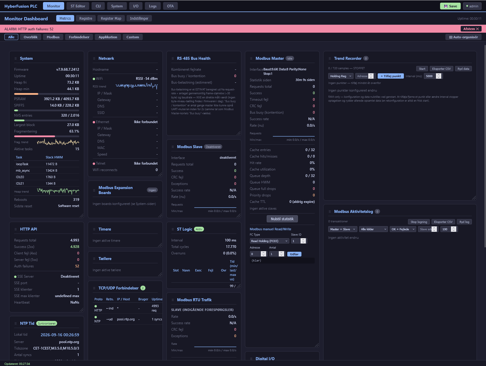
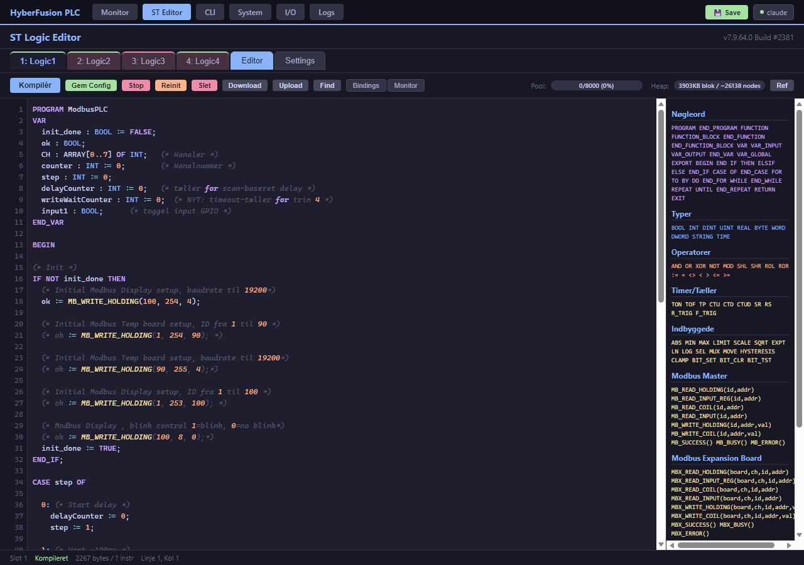
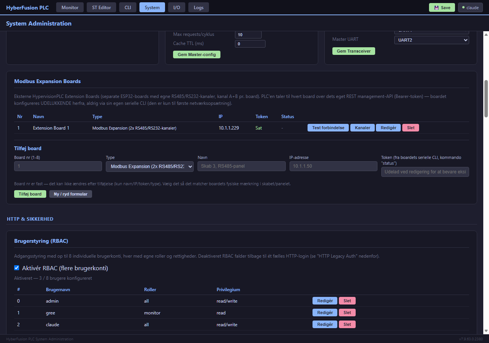

# Hypervision PLC — ESP32 Modbus RTU/TCP Server

**A lightweight, network-connected PLC on an ESP32** — Modbus RTU Slave *and* Master, an IEC 61131-3 Structured Text runtime, a REST API, and a full web dashboard, all in one firmware image.

[](BUGS_INDEX.md)
[](docs/manual/02_Hardware_og_Moduler.md)
[](platformio.ini)
[](docs/manual/00_INDEKS.md)

---

## What is it?

Hypervision PLC combines three things that traditionally need separate hardware:

1. **A Modbus RTU slave** — answers requests from a SCADA/HMI system like a standard Modbus I/O device.
2. **A Modbus RTU master** (plus TCP master support for external expansion boards) — polls other devices and makes their data available internally.
3. **A programmable logic layer** — an IEC 61131-3 Structured Text (ST) runtime that runs independently of the Modbus traffic, can read/write registers, drive GPIO, run counters/timers, and act as a Modbus master itself.

The same device is reachable both the classic way (RS-485/Modbus RTU) and the modern way (REST API, web dashboard, Wi-Fi/Ethernet) — it can sit in a cabinet talking RTU to a legacy SCADA system while a Node-RED flow or Python service reads and writes the same data over HTTP.

**Not sure where to start?** The [full user manual](docs/manual/00_INDEKS.md) (17 chapters, Danish) is the authoritative, actively-maintained reference for everything below — this README is a map, not the territory.

---

## Screenshots

| Monitor dashboard | ST Logic editor |
|---|---|
|  |  |

| System administration — Modbus Expansion Boards & RBAC |
|---|
|  |

---

## Key features

| Area | Details |
|---|---|
| **Modbus Slave** | RTU over RS-485. Configurable slave ID, baud rate, parity. Standard function codes (read/write coils, discrete inputs, holding and input registers). |
| **Modbus Master** | Asynchronous background task with a priority queue and cache — polls external devices without ever blocking the ST runtime. Configurable via CLI, REST or ST. |
| **Modbus Expansion Boards** | Manage external "HypervisionPLC Extension Board" units (their own RS-485/RS-232 channels) directly from the PLC's own web UI — Modbus **TCP** data-plane plus a REST management API, with an `MBX_*` ST Logic function family for continuous polling. |
| **ST Logic (Structured Text)** | Up to 4 independent programs, an IEC 61131-3-inspired language with a real type system (BOOL/INT/DINT/REAL/DWORD/TIME), compiled to bytecode and run on an embedded VM. IF/CASE/FOR/WHILE/REPEAT, user-defined FUNCTION/FUNCTION_BLOCK, TON/TOF/TP timers, CTU/CTD/CTUD counters, and direct Modbus master calls (`MB_READ_HOLDING`, `MB_WRITE_HOLDING`, …). |
| **Counters & Timers** | 4 independent, hardware-aware counters (software-, hardware- or interrupt-driven) and 4 timers with several operating modes, all exposed to both Modbus and ST Logic. |
| **REST API** | JSON over HTTP(S) — configuration, register/coil access, GPIO, ST Logic programs (including a step debugger), backup/restore, OTA updates, Prometheus metrics. |
| **Web Dashboard** | Live monitor with a freely-arrangeable card grid, an ST Logic editor with a debugger and trend view, a browser-based CLI console, alarm history and a wire-level Modbus activity log. A public, login-free status page is available too. |
| **CLI** | Full `show`/`set` command set, identical over serial USB, Telnet and the browser. |
| **Networking** | Wi-Fi and/or wired Ethernet (W5500), NTP time sync, static IP or DHCP. |
| **Security** | Role-based access control (RBAC) with multiple users/roles, optional HTTPS/TLS, an IP access control list with a firewall-style draft/commit workflow, rate limiting. |

---

## Supported hardware

| Board | Module | Notes |
|---|---|---|
| ESP32-WROOM-32 (30-pin) | ESP32-D0WD | Direct GPIO access, general prototyping |
| ESP32-WROOM-32 (38-pin) | ESP32-D0WD | As above, more physical pins |
| **ES32D26** (Eletechsup) | ESP32-D0WD-V3 / WROVER, 4 MB PSRAM | Industrial I/O module: 8× digital in, 8× relay out, 8× analog in, 2× analog out, onboard RS-485 |
| Waveshare ESP32-S3-ETH | ESP32-S3 | Built-in wired Ethernet (onboard W5500) |

See [chapter 2 of the manual](docs/manual/02_Hardware_og_Moduler.md) for full pin-level detail.

---

## Quick start

```bash
# Build & flash (PlatformIO)
pio run -e es32d26 -t upload

# First contact: serial console, 115200 baud
pio device monitor

# Once it has an IP, open the web UI
http://<device-ip>/            # public status page, no login required
http://<device-ip>/dashboard   # full dashboard (login required)
```

Full walkthrough — serial provisioning, network setup, first login, hardening checklist — in [chapter 3 of the manual](docs/manual/03_Installation_og_Foerste_Opstart.md).

---

## Documentation

| I need to... | Read this |
|---|---|
| **Get a full overview** | [docs/manual/00_INDEKS.md](docs/manual/00_INDEKS.md) — the complete manual, start here |
| **Look up a CLI command** | [Appendix A: CLI reference](docs/manual/A_CLI_Kommando_Reference.md) |
| **Look up a REST endpoint** | [Appendix B: REST API reference](docs/manual/B_REST_API_Reference.md) |
| **Look up an ST Logic function** | [Appendix D: ST Logic function reference](docs/manual/D_ST_Logic_Funktionsreference.md) |
| **See the full Modbus register map** | [MODBUS_REGISTER_MAP.md](MODBUS_REGISTER_MAP.md) |
| **Set up GPIO mapping** | [docs/GPIO_MAPPING_GUIDE.md](docs/GPIO_MAPPING_GUIDE.md) |
| **Integrate over SSE (real-time push)** | [docs/SSE_USER_GUIDE.md](docs/SSE_USER_GUIDE.md) |
| **Check known bugs / recent changes** | [BUGS_INDEX.md](BUGS_INDEX.md) ⚡ single source of truth for what's fixed/implemented and when |
| **Review security posture** | [SECURITY_INDEX.md](SECURITY_INDEX.md) |
| **See release-level version history** | [CHANGELOG.md](CHANGELOG.md) |
| **Contribute code** | [CLAUDE.md](CLAUDE.md) → [CLAUDE_ARCH.md](CLAUDE_ARCH.md) (architecture & file reference) |

---

## Architecture in one picture

```
                    ┌─────────────────────────────────────────┐
                    │              Hypervision PLC             │
                    │                                           │
  RS-485 ───────────┤  Modbus Slave (UART)                     │
  (SCADA/HMI)        │       ↕                                  │
                    │  Register/Coil Storage ←──┐               │
                    │       ↕                    │              │
  RS-485 ───────────┤  Modbus Master (UART) ─────┤              │
  (external devices) │  (async queue + cache)      │              │
  Modbus TCP ────────┤  Expansion Board client ────┤              │
  (extension boards) │       ↕                    │              │
                    │  ST Logic VM (×4 programs) ─┘              │
                    │       ↕                                   │
                    │  Counters / Timers / GPIO                 │
                    │                                           │
  Wi-Fi/Ethernet ───┤  REST API · Web Dashboard · CLI (Telnet)  │
                    └─────────────────────────────────────────┘
```

The register/coil store is the central hub: the Modbus slave, Modbus master, ST Logic, counters/timers and the REST API all read and write the same storage — which is why one device can be a slave and a master at once, driven locally (ST Logic) and externally (SCADA or REST) at the same time.

---

## Contributing

This repository is developed with heavy Claude Code assistance. [CLAUDE.md](CLAUDE.md) is the entry point for the project's own working conventions (Danish): check [BUGS_INDEX.md](BUGS_INDEX.md) before touching any code area, keep [docs/manual/](docs/manual/00_INDEKS.md) in sync with user-facing changes, and see [CLAUDE_ARCH.md](CLAUDE_ARCH.md) for the layered file structure before diving in.

---

## Support & issues

- **Bugs / feature requests:** [GitHub Issues](https://github.com/Jangreenlarsen/HypervisionPLC/issues)
- **Known issues & their status:** [BUGS_INDEX.md](BUGS_INDEX.md)
- **Serial diagnostics:** `show status`, `show version`, `show debug` over the CLI

## License

No license has been declared for this repository yet — all rights reserved by default until one is added.

---

**Maintainer:** Jan Green Larsen
