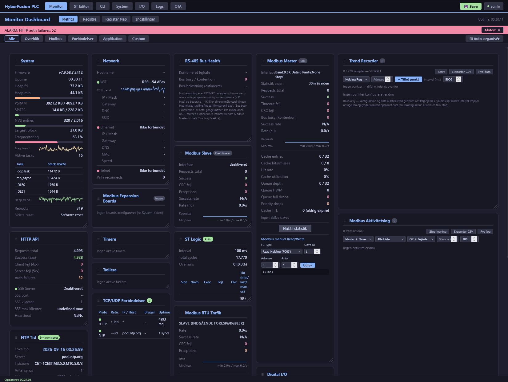
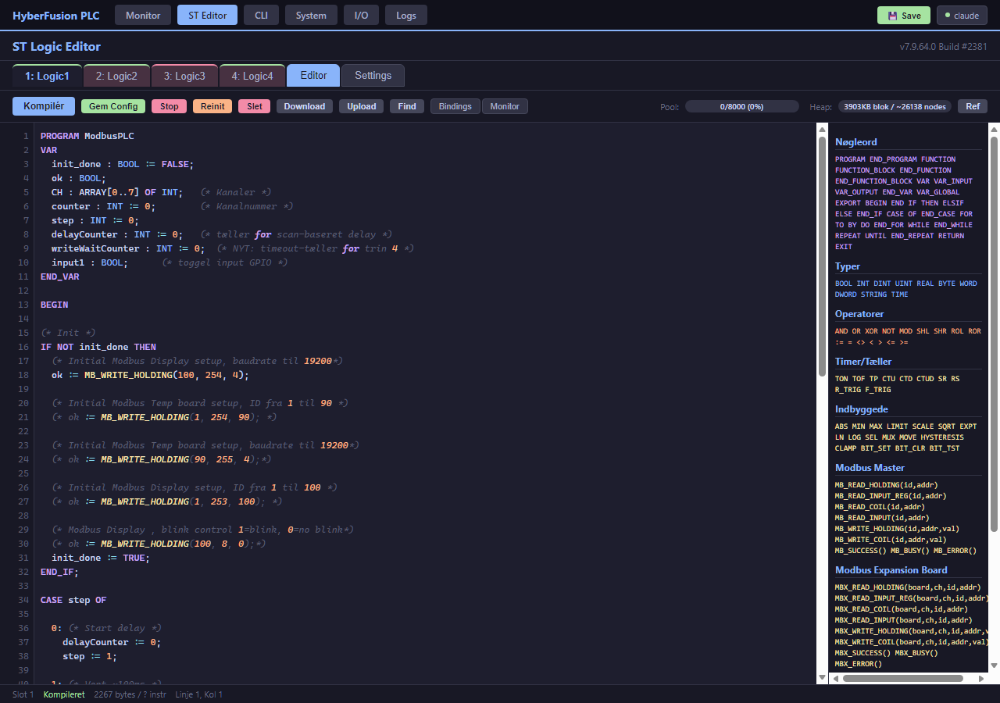

# Hypervision PLC — ESP32 Modbus RTU/TCP PLC

**A network-connected PLC on an ESP32.** One firmware image provides a Modbus RTU slave and master, an IEC 61131-3 Structured Text runtime, counters/timers, a REST API and a web dashboard.

[](CHANGELOG.md)
[-informational)](docs/manual/02_Hardware_og_Moduler.md)
[](platformio.ini)
[](LICENSE)
[](docs/manual/00_INDEKS.md)

---

## What it does

- **Modbus RTU slave** on RS-485. A SCADA/HMI system sees it as a standard Modbus I/O device.
- **Modbus master.** It polls external RTU devices in the background through a queue and cache, and it talks Modbus TCP to HypervisionPLC expansion boards.
- **ST Logic.** Up to 4 Structured Text programs are compiled to bytecode and run on an embedded VM, independently of the Modbus traffic.
- **REST API, web dashboard and CLI** over Wi-Fi or Ethernet.

All parts share one register/coil store. ST Logic, a SCADA master and a REST client can therefore read and write the same data at the same time.

The **[user manual](docs/manual/00_INDEKS.md)** (Danish, 13 chapters + 4 appendices) is the authoritative reference. This README is only a map.

---

## Screenshots

| Monitor dashboard | ST Logic editor |
|---|---|
|  |  |

---

## Features

| Area | Details |
|---|---|
| **Modbus slave** | RTU over RS-485. Slave ID, baud rate and parity are configurable. FC01–06, FC15, FC16. DYNAMIC registers/coils can mirror counter, timer and ST values to any address. |
| **Modbus master** | Asynchronous task with a priority queue and cache, so it never blocks ST Logic. Configured via CLI, REST or ST (`MB_READ_HOLDING`, `MB_WRITE_COIL`, …). |
| **Expansion boards** | External boards with their own RS-485/RS-232 channels. They are managed from the PLC's web UI over Modbus TCP plus a REST management API, and polled from ST with the `MBX_*` functions. |
| **ST Logic** | IEC 61131-3 style with BOOL/INT/DINT/REAL/DWORD/TIME/STRING, STRUCT, GLOBAL_VAR shared between programs, FUNCTION/FUNCTION_BLOCK, TON/TOF/TP, CTU/CTD/CTUD and SAVE/LOAD. The editor has a step debugger, trend view and a register monitor (`(* @watch … *)`). A per-program watchdog can stop or restart a program that runs away. |
| **Counters & timers** | 4 counters with prescaler, scale, compare and auto-start. 4 timers: one-shot, monostable, astable and input-triggered. Both are exposed to Modbus and ST. |
| **REST API & SSE** | JSON over HTTP(S): configuration, registers/coils, GPIO, ST programs, backup/restore, OTA and Prometheus metrics. Server-Sent Events push changes in real time. |
| **Web dashboard** | Free-layout live monitor, ST editor, browser CLI, I/O configuration, alarm history and a Modbus activity log. A public status page needs no login. |
| **CLI** | `show`/`set` commands, identical over serial USB, Telnet and the browser. `show config` output can be pasted straight back in. |
| **Networking** | Wi-Fi and/or wired Ethernet (W5500), DHCP or static IP, NTP. |
| **Security** | RBAC with multiple users/roles, HTTPS/TLS, session cookies, an IP access list with draft/commit, and rate limiting. Findings are tracked in [SECURITY_INDEX.md](SECURITY_INDEX.md). |

---

## Hardware

| Board | PlatformIO env | Notes |
|---|---|---|
| **ES32D26** (Eletechsup, ESP32-WROVER, 4 MB PSRAM) | `es32d26` | Main target. 8 DI (via 74HC165), 8 relays, analog in/out, RS-485, DM56A04 display. Counters run in `sw` mode only. |
| ESP32-WROOM-32 DevKit | `esp32` | Direct GPIO, used for prototyping. |

See [manual chapter 2](docs/manual/02_Hardware_og_Moduler.md) and the [ES32D26 board guide](docs/ES32D26_BOARD_GUIDE.md) for pin details.

---

## Build, flash and test

```bash
pio run -e es32d26               # build (web assets are minified, LTO enabled)
pio run -e es32d26 -t upload     # flash over USB
pio device monitor               # serial CLI, 115200 baud

bash test/st_host/run.sh         # ST compiler/VM tests on the PC (no hardware)
bash test/cli_host/run.sh        # CLI parser tests on the PC (no hardware)
```

After the first flash, update over the network: in the web UI choose **System → OTA**, or `POST /api/system/ota`. OTA only accepts **signed** firmware (`firmware_signed.bin`, made by the build when `certs/ota_signing.key` exists — see [docs/RELEASE_PROCEDURE.md](docs/RELEASE_PROCEDURE.md)).

To get started, open `http://<device-ip>/` (status page) or `/dashboard` (login). The full walkthrough is in [manual chapter 3](docs/manual/03_Installation_og_Foerste_Opstart.md).

---

## Repository layout

```
src/, include/        Firmware (C++), ~30 modules — see CLAUDE_ARCH.md
web/                  Web UI pages (minified + gzipped into the firmware at build time)
scripts/              Build scripts (build info, web minify/gzip, LTO link) and release script
test/st_host/         PC test harness for the ST compiler and VM
test/cli_host/        PC test harness for the CLI parser
docs/manual/          User manual (Danish) — the authoritative documentation
docs/                 Focused guides: counters, ES32D26, DM56A04 display, release procedure
docs/expansion/       Expansion board design and PLC integration contract
docs/plans/           Open design investigations
nodered/              Node-RED node for the SSE event stream
certs/                Public TLS certificate (the private key is never committed)
archive/              Historical analyses, old test plans and scripts — not maintained
```

Tracking files in the root:

| File | Purpose |
|---|---|
| [CHANGELOG.md](CHANGELOG.md) | Version history |
| [BUGS_INDEX.md](BUGS_INDEX.md) | All bugs and features (BUG-/FEAT-IDs) with status. Check it before changing code |
| [SECURITY_INDEX.md](SECURITY_INDEX.md) | Security findings, fixed and open |
| [CLAUDE.md](CLAUDE.md) | Entry point for development conventions → [CLAUDE_ARCH.md](CLAUDE_ARCH.md), [CLAUDE_WORKFLOW.md](CLAUDE_WORKFLOW.md) |

---

## Documentation

| I need to… | Read |
|---|---|
| Get an overview | [docs/manual/00_INDEKS.md](docs/manual/00_INDEKS.md) |
| Look up a CLI command | [Appendix A](docs/manual/A_CLI_Kommando_Reference.md) |
| Look up a REST endpoint | [Appendix B](docs/manual/B_REST_API_Reference.md) |
| Look up an ST function | [Appendix D](docs/manual/D_ST_Logic_Funktionsreference.md) |
| Configure counters | [Manual §9.1](docs/manual/09_Taellere_og_Timere.md), [counter templates](docs/COUNTER_CONFIG_TEMPLATES.md) |
| Find register addresses | The **Register Map** page in the dashboard ([manual ch. 6](docs/manual/06_Modbus_Interface.md)) |
| Integrate an expansion board | [docs/expansion/PLC_INTEGRATION_MANUAL.md](docs/expansion/PLC_INTEGRATION_MANUAL.md) |
| Make a release | [docs/RELEASE_PROCEDURE.md](docs/RELEASE_PROCEDURE.md) |

---

## Architecture

```
                    ┌───────────────────────────────────────────┐
  RS-485 ───────────┤  Modbus slave (UART)                       │
  (SCADA/HMI)       │       ↕                                    │
                    │  Register / coil store  ←──────┐           │
                    │       ↕                         │           │
  RS-485 ───────────┤  Modbus master (async + cache) ─┤           │
  Modbus TCP ───────┤  Expansion board client ────────┤           │
                    │       ↕                         │           │
                    │  ST Logic VM (4 programs) ──────┘           │
                    │       ↕                                     │
                    │  Counters · Timers · GPIO · Display         │
  Wi-Fi/Ethernet ───┤  REST API · SSE · Web dashboard · Telnet CLI│
                    └───────────────────────────────────────────┘
```

---

## Issues

- Bugs and feature requests: [GitHub Issues](https://github.com/Jangreenlarsen/HypervisionPLC/issues)
- Known issues: [BUGS_INDEX.md](BUGS_INDEX.md)
- Diagnostics: `show status`, `show version`, `show debug` in the CLI

## License

Copyright (C) 2025-2026 Jan Green Larsen

Hypervision PLC is free software: you can redistribute it and/or modify it under the terms of the **GNU Affero General Public License v3.0 or later** (AGPL-3.0-or-later), as published by the Free Software Foundation. See [LICENSE](LICENSE) for the full text.

If you run a modified version on a device that users interact with over the network (web UI, REST API, Telnet), section 13 of the AGPL requires you to offer them the corresponding source code. The firmware shows a source link on the status page, the System page and in `show version` — change `PROJECT_SOURCE_URL` in `include/constants.h` to point to your own fork.

Third-party components keep their own licenses: Arduino-ESP32 / ESP-IDF (Apache-2.0 / LGPL-2.1), ArduinoJson (MIT) and mbedTLS (Apache-2.0).

**Maintainer:** Jan Green Larsen
