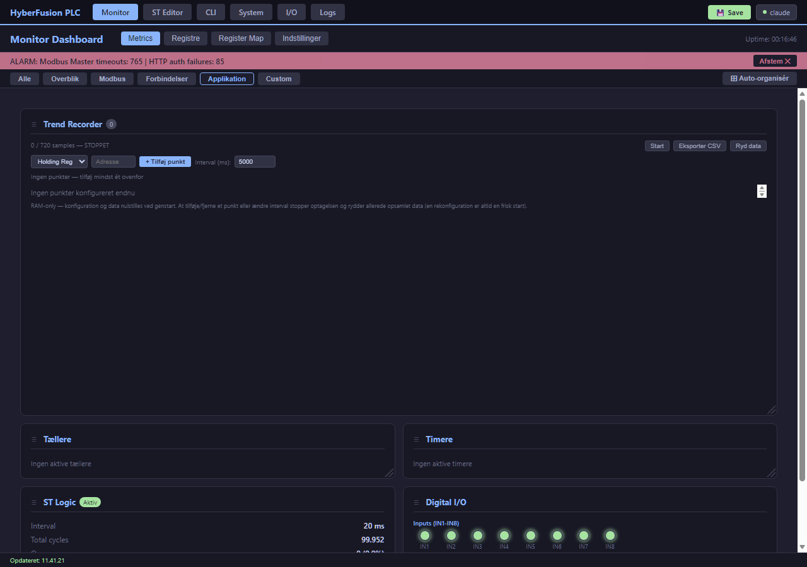

# 2. Hardware & Moduler

[← 1. Systembeskrivelse](01_Systembeskrivelse.md) · [Indeks](00_INDEKS.md) · Næste: [3. Installation →](03_Installation_og_Foerste_Opstart.md)

---

## 2.1 Understøttede board-varianter

Hypervision PLC-firmwaren bygges til én af tre hovedvarianter, valgt via en build-flag i `platformio.ini`. Alle deler samme softwarelag (Modbus, ST Logic, REST API, dashboard) — forskellen er GPIO-tildeling og fysisk IO.

| Variant | Modul | Beregnet til |
|---------|-------|--------------|
| **ESP32-WROOM-32 (30-pin)** — standard | ESP32-D0WD | Generel udviklings-/prototype-brug, direkte GPIO-adgang |
| **ESP32-WROOM-32 (38-pin)** | ESP32-D0WD | Som ovenfor, flere fysiske pins tilgængelige |
| **ES32D26** (Eletechsup) | ESP32-D0WD-V3 rev3.1 / ESP32-WROVER (4 MB PSRAM) | Industri-IO-modul: 8× digital ind, 8× relæudgang, 8× analog ind, 2× analog ud, onboard RS-485 |
| **Waveshare ESP32-S3-ETH** | ESP32-S3 | Indbygget kablet Ethernet (W5500 onboard, ingen ekstern ledning) |

> Se [`../ES32D26_BOARD_GUIDE.md`](../ES32D26_BOARD_GUIDE.md) og [`../ES32D26_pins.md`](../ES32D26_pins.md) for komplet, verificeret pin-for-pin-dokumentation af ES32D26-varianten — det mest brugte industri-board. Dette kapitel giver overblikket; de filer giver detaljerne.

## 2.2 IO-oversigt (ES32D26)

Det mest almindeligt anvendte board i felten. Alt IO er hardware-signalkonditioneret på boardet — ingen eksterne komponenter nødvendige for standard 0-10V/4-20mA/24V-signaler.

| Type | Antal | Detaljer |
|------|-------|----------|
| **Digitale indgange (DI)** | 8 | Via SN74HC165 skifteregister, opto-isoleret |
| **Digitale udgange / relæer (DO)** | 8 | Via SN74HC595 skifteregister |
| **Analoge indgange, spænding** | 4 | 0-10V (Vi1-Vi4) |
| **Analoge indgange, strøm** | 4 | 4-20mA (Ii1-Ii4) |
| **Analoge udgange** | 2 | DAC-baseret (Vo/Io, AO1-AO2) |
| **RS-485** | 1 | Onboard transceiver, delt mellem Modbus Slave og Master (kun én rolle ad gangen — se §2.4) |
| **Ethernet (valgfri)** | 1 | Via eksternt W5500-modul over SPI |

Digitale ind- og udgange tilgås internt som **virtuelle GPIO'er** (101-108 for indgange, 201-208 for relæudgange), så de kan bindes til Modbus-registre og ST Logic-variabler på præcis samme måde som fysiske GPIO-pins.

**DI1-8/DO1-8 — de navne du ser i web-GUI'ets `/io`-side og typisk også på boardets egne klemmer — ER blot brugervenlige navne for disse samme virtuelle GPIO-numre, ikke en tredje, separat adressering:**

| GUI-/klemme-navn | Virtuel GPIO | GUI-/klemme-navn | Virtuel GPIO |
|---|---|---|---|
| DI1 | 101 | DO1 | 201 |
| DI2 | 102 | DO2 | 202 |
| DI3 | 103 | DO3 | 203 |
| DI4 | 104 | DO4 | 204 |
| DI5 | 105 | DO5 | 205 |
| DI6 | 106 | DO6 | 206 |
| DI7 | 107 | DO7 | 207 |
| DI8 | 108 | DO8 | 208 |

**Der er intet ekstra lag at holde styr på** — overalt hvor denne manual (eller CLI'en/REST API'et) beder om et "GPIO-pin"-tal, er det tallet fra tabellen ovenfor (101-108/201-208) der bruges, uanset om du selv tænker på kanalen som "DI3" eller "GPIO 103". Kilde: `web/io.html`'s egen GPIO-dropdown, som viser præcis disse par ved siden af hinanden.

Live-status for digitale/analoge kanaler vises på dashboardet ([kapitel 4](04_Web_Dashboard_og_Monitor.md)):



### 2.2.1 Hvorfor "virtuelle" GPIO'er? — skifteregistrene bag de 8+8 kanaler

ES32D26 har **ikke** 8 separate ESP32-pins forbundet direkte til de 8 digitale indgange (og tilsvarende for de 8 relæudgange) — det ville kræve flere pins end boardet reelt stiller til rådighed ved siden af RS-485, Ethernet, analog-IO og USB. I stedet **multiplexes** alle 8 kanaler over et enkelt **skiftregister**-chip, som kun bruger 3-4 ESP32-pins uanset kanalantal:

| Retning | Chip | ESP32-pins brugt | Funktion |
|---|---|---|---|
| **Indgange (DI)** | SN74HC165 (parallel-ind, seriel-ud) | GPIO0 (Parallel Load / SH-LD), GPIO2 (Clock), GPIO15 (Serial Data ind) | Alle 8 opto-isolerede indgangstilstande "skydes" seriel ind over disse 3 pins, ét bit ad gangen, ved hver poll |
| **Udgange (DO/relæ)** | SN74HC595 (seriel-ind, parallel-ud) | GPIO12 (Serial Data ud), GPIO22 (Shift Clock), GPIO23 (Latch), GPIO13 (Output Enable) | Alle 8 relætilstande skydes seriel UD over disse pins, "clockes" ud til de 8 fysiske relæer samtidig via latch-pinnen |

Denne teknik (klassisk "parallel-in/serial-out" hhv. "serial-in/parallel-out" skifteregister) er grunden til at GPIO2 (som ellers bærer status-LED'en på andre boardvarianter) er optaget på ES32D26, jf. §2.5. **Softwaren skjuler hele denne kompleksitet** — som bruger ser du blot 8 "virtuelle GPIO'er" (101-108 for indgange, 201-208 for udgange), der opfører sig præcis som almindelige fysiske pins i alle CLI-, REST- og ST Logic-sammenhænge; selve skifteregister-udlæsningen/-skrivningen sker automatisk i baggrunden ved hver loop-iteration. Se [`../ES32D26_BOARD_GUIDE.md`](../ES32D26_BOARD_GUIDE.md) for den fulde, multimeter-verificerede pin-for-pin-tabel, og CLI-kommandoen `test sr`/`test sr input` ([Appendiks A](A_CLI_Kommando_Reference.md)) for at teste selve skifteregistrene direkte uden om GPIO-mapping-laget.

### 2.2.2 Sådan konfigureres og bruges en GPIO-indgang

Uanset om det er en fysisk pin (0-39) eller en virtuel skifteregister-kanal (101-108/201-208, dvs. DI1-8/DO1-8 — se tabellen ovenfor), foregår opsætningen på samme måde — GPIO'en skal først **mappes til en Modbus discrete input-adresse**, før dens tilstand kan læses fra Modbus-master-systemer, dashboardet, eller (vigtigst) et ST Logic-program. Eksemplet her bruger **DI1** (= virtuel GPIO 101):

```
set gpio 101 input 5      (* DI1 (virtuel GPIO 101) → discrete input-adresse 5 *)
show gpio                 (* bekræft mappingen — vises som pin 101 *)
read input 5              (* læs den rå tilstand direkte, uden om ST Logic *)
```

Samme opsætning via REST API ([Appendiks B, §B.8](B_REST_API_Reference.md#b8-gpio)):
```bash
curl -u admin:modbus123 -X POST http://192.168.1.100/api/gpio/101/config \
     -H "Content-Type: application/json" -d '{"direction":"input","register":5}'
```

Eller via web-GUI'ets `/io`-side (GPIO Statisk Mapping-sektionen, FEAT-171).

**For at læse GPIO-indgangen fra et ST Logic-program** kræves et **andet, uafhængigt bindings-trin** — se [§8.13](08_ST_Logic_Programmering.md#813-gpio-indgange-i-st-logic-bindings-mode) for den fulde forklaring og et gennemarbejdet eksempel med de multiplexede skifteregister-indgange.

## 2.3 Trådløs og kablet netværk

- **Wi-Fi** — indbygget på alle ESP32-varianter. Klient-mode (tilslutter et eksisterende netværk).
- **Ethernet (W5500)** — valgfrit eksternt SPI-modul (indbygget på Waveshare S3-ETH). Kan køre samtidig med Wi-Fi.
- Begge kan have statisk IP eller DHCP, konfigureres uafhængigt af hinanden. Se [kapitel 12](12_Netvaerkskonfiguration.md).

## 2.4 Modbus-transceiver: delt vs. dedikeret UART

Dette er den vigtigste hardware-detalje at forstå før installation:

- **ESP32-WROOM-32 (30/38-pin):** UART0 (USB-seriel) er Modbus **Slave**, UART1 (separate GPIO-pins) er Modbus **Master**. De to roller har **hver deres fysiske UART** og kan køre samtidig.
- **ES32D26:** har kun **én** RS-485-transceiver ombord, delt mellem Slave- og Master-rollen (`MODBUS_SINGLE_TRANSCEIVER`). Systemet kan altså være **enten** Slave **eller** Master ad gangen på dette board — ikke begge samtidig — styret af `set modbus mode slave|master`. Samme fysiske pins (GPIO1/GPIO3) deles desuden med USB-seriel-konsollen ved boot; se boot-sekvensen i [kapitel 3](03_Installation_og_Foerste_Opstart.md#opstart-pa-es32d26--rs-485-vs-usb-konsol).

> **Vigtigt ved ES32D26:** hvis I har brug for at være Modbus Slave **og** Master samtidig, kræver det enten et separat RS-485-modul på en anden UART, eller en anden board-variant med to fysisk adskilte UART'er.

## 2.5 Status-LED og fysiske indikatorer

Standard-boards har en status-LED på GPIO2 (hjerteslag, ca. 500 ms interval — se `HEARTBEAT_INTERVAL_MS`), der viser at hovedløkken kører. **På ES32D26 er GPIO2 optaget af skifteregister-logikken**, så der er ingen fysisk status-LED på dette board — brug i stedet dashboardets uptime-visning eller CLI'ens `show status` til at bekræfte at systemet kører.

## 2.6 Flash & hukommelse

| Ressource | Standard ESP32-WROOM-32 | ES32D26 (WROVER) |
|-----------|--------------------------|--------------------|
| Flash | 4 MB | 4 MB |
| PSRAM | Ingen | 4 MB (aktiveret, bruges til ST Logic-kildekode-pool) |
| NVS (konfiguration) | 64 KB partition | 64 KB partition |
| OTA-partitioner | 2× ~1,8 MB (dual-bank, rollback-understøttet) | Samme |

Flash er typisk 96% udnyttet på et fuldt konfigureret build (Ethernet + alle features, inkl. Modbus Expansion Boards-integrationen, aktiveret) — se [`../../BUGS_INDEX.md`](../../BUGS_INDEX.md) (FEAT-145/146 for baggrund om den oprindelige flash-optimering der gjorde plads til PSRAM-migreringen, FEAT-411 for den seneste runde flash-analyse/-optimering) for detaljer og løbende status.

---

[← 1. Systembeskrivelse](01_Systembeskrivelse.md) · [Indeks](00_INDEKS.md) · Næste: [3. Installation →](03_Installation_og_Foerste_Opstart.md)
