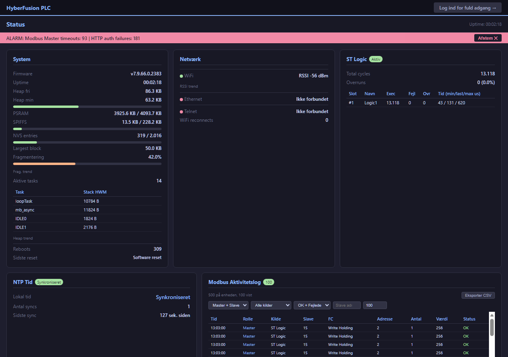
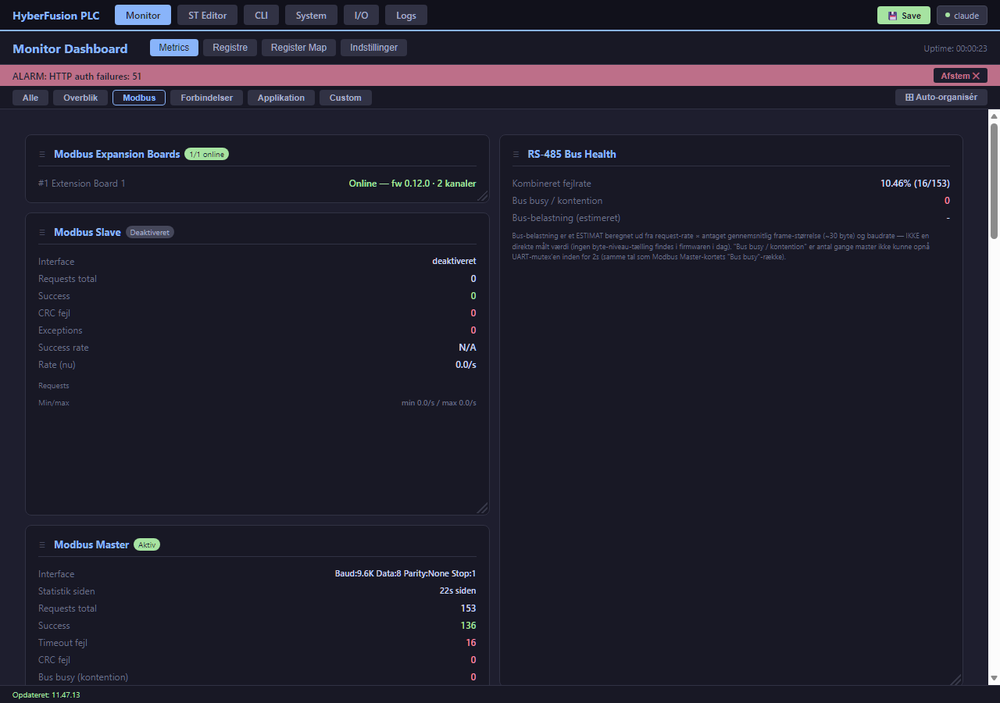
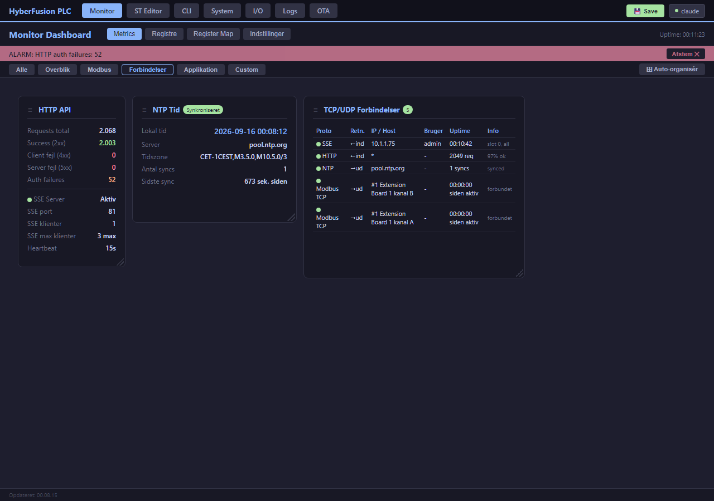
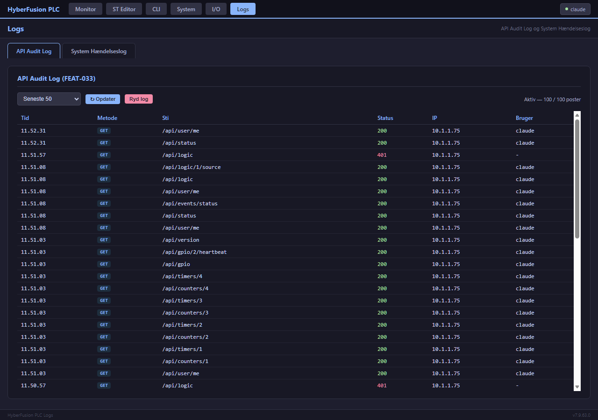
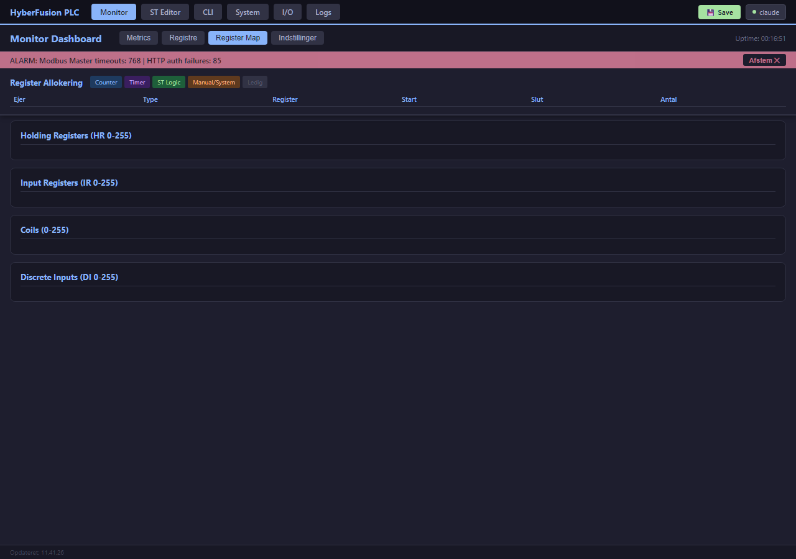
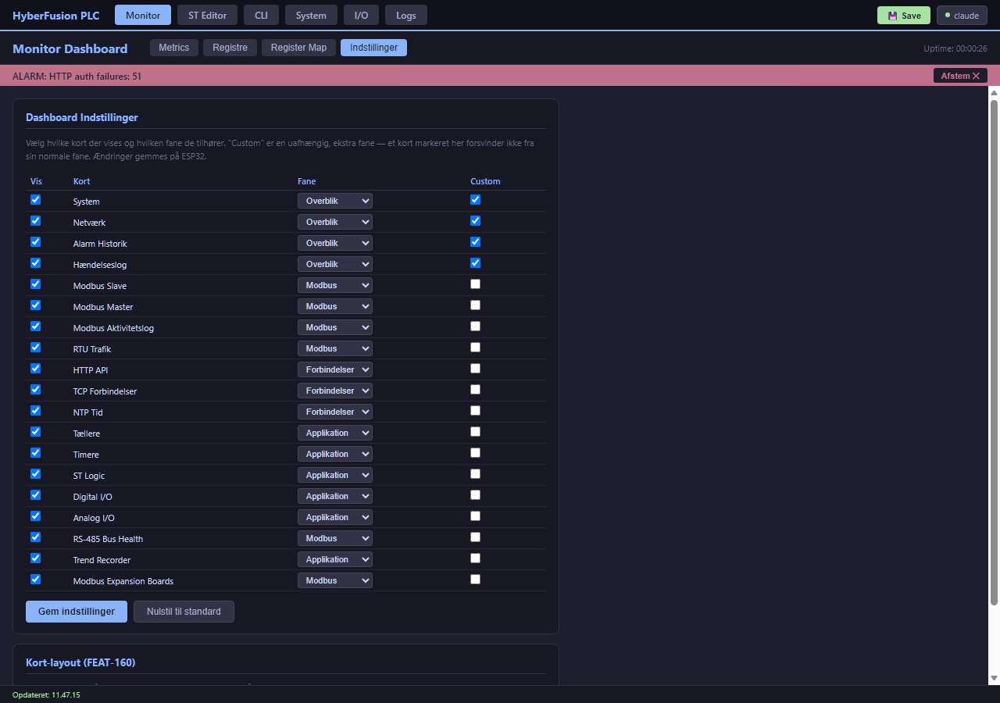
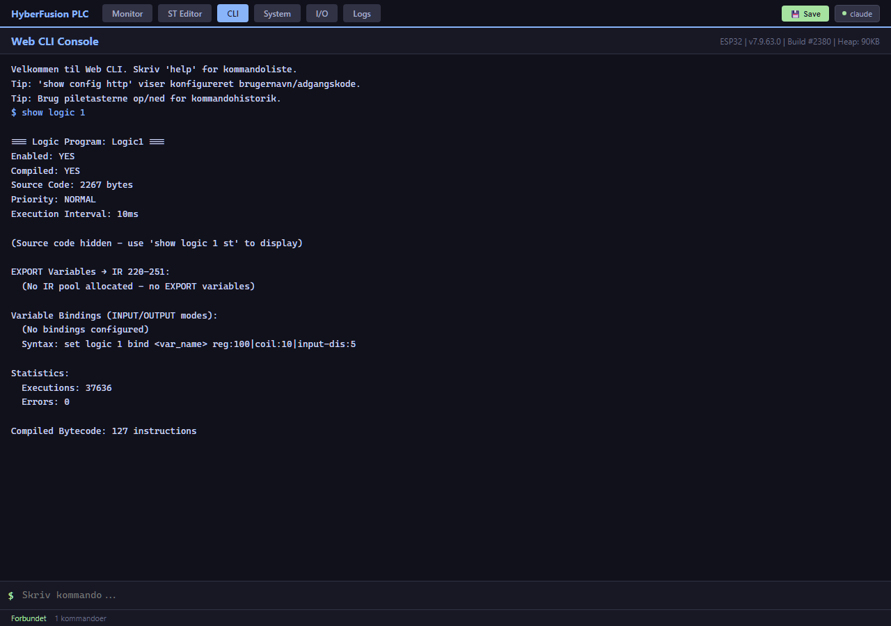

# 4. Web Dashboard & Monitor

[← 3. Installation](03_Installation_og_Foerste_Opstart.md) · [Indeks](00_INDEKS.md) · Næste: [5. CLI/Konsol →](05_CLI_Konsol.md)

---

## 4.1 Sideoversigt

Webgrænsefladen består af otte sider — en offentlig, login-fri statusside plus syv login-krævende sider bag samme topnavigation:

| Side | URL | Login krævet? | Formål |
|------|-----|:---:|--------|
| **Status** | `/` | Nej (FEAT-407) | Offentligt, admin-udvalgt statusoverblik — se nedenfor |
| **Dashboard** | `/dashboard` | Ja | Live-monitor: system, netværk, Modbus, alarmer, tællere/timere, ST Logic |
| **ST Logic Editor** | `/editor` | Ja | Skriv, kompilér, upload og debug ST-programmer med runtime-monitor |
| **Web-CLI** | `/cli` | Ja | Fuld CLI-konsol i browseren — samme kommandoer som seriel/telnet |
| **System** | `/system` | Ja | Systemindstillinger (uden for det almindelige `set`-CLI-flow) |
| **I/O** | `/io` | Ja | Konfiguration af Tællere, Timere og GPIO statisk mapping (FEAT-171) |
| **Logs** | `/logs` | Ja | Alle logs samlet i fuld sidebredde, som faner: API Audit Log, System Hændelseslog, Modbus Aktivitetslog og Alarm Historik (FEAT-172/451/452; `/logs#sys`, `/logs#modbus` og `/logs#alarm` åbner fanen direkte) — se [§4.2](#42-dashboard--layout-og-faner) |
| **OTA-opdatering** | `/ota` | Ja | Upload ny firmware |

**Login sker via en server-sat, HttpOnly session-cookie** (`POST /api/login`, se [§10.3](10_Sikkerhed_og_Adgangsstyring.md#103-standard-credentials--skal-ændres) for den fulde arkitekturforklaring, BUG-393) — browseren sender og opbevarer den automatisk, der er intet for JavaScript (eller jer) at gemme manuelt. En aktiv fane logges ikke ud; en glemt fane gør efter 30 minutters inaktivitet.

### Den offentlige statusside (`/`, FEAT-407)

Siden "/" kræver **ikke** login og viser et admin-udvalgt, skrivebeskyttet subset af dashboard-kortene (vælges på Monitor-siden under fanen **Statusside** — se [§4.2](#statusside-fanen-feat-434)) — praktisk til fx et infoskærm-visning i produktionen, uden at dele login-adgang ud. Klik **"Log ind for fuld adgang →"** for at komme til det fulde, login-krævende `/dashboard`:

## 4.2 Dashboard — layout og faner

Dashboardet er organiseret i **kort** (cards), grupperet under faner:

- **Alle** — alle kort samlet
- **Overblik** — Watchdog (FEAT-427), System, Netværk
- **Modbus** — Modbus (slave + master + cache), RS-485 / UART, Modbus Expansion Boards (FEAT-450 samlede de tidligere kort Modbus Slave, Modbus Master, RTU-trafik og RS-485 Bus Health)

**FEAT-452: alle logs ligger på Logs-siden.** Modbus Aktivitetslog, Alarm Historik og Hændelseslog er fjernet fra Monitor-dashboardet og findes nu kun som faner på **`/logs`** (se nedenfor). ALARM-banneret øverst på Monitor-siden (aktuelle grænseværdi-alarmer) er uændret.
- **Forbindelser** — HTTP API/SSE, TCP/UDP-forbindelsesmonitor (inkl. Modbus TCP til expansion boards), NTP
- **Applikation** — Tællere, Timere, ST Logic, Digital I/O (Trend Recorder har sin egen fane **Trend** i toppen, FEAT-444)
- **Custom (FEAT-167)** — et uafhængigt, brugervalgt kort-sæt, se nedenfor

**Fri kort-placering (FEAT-160):** hvert kort kan flyttes vilkårligt (træk i ☰-håndtaget i kortets titel, eller ved at venstreklikke og holde et vilkårligt sted på kortet — undtagen på knapper/felter/links, FEAT-162) og størrelsesændres frit (træk i hjørne-håndtaget nederst til højre) i et 12-kolonners grid — ikke bare et bred/normal-valg, men fuld 2D-placering ligesom et dashboard-builder-værktøj (Grafana e.l.). Lander man et kort oven i et andet, bytter de plads; overlapper en ny størrelse et nabokort, skubbes det ned. Alle periodiske dataopdateringer sættes på pause, mens et kort aktivt flyttes/resizes (BUG-359), så kortet ikke "snapper" tilbage midt i trækket.

**Layoutet gemmes separat pr. skærmstørrelse OG pr. fane (FEAT-167):** at flytte "Modbus Slave"-kortet mens du kigger på Modbus-fanen ændrer IKKE dets position på Alle-fanen eller Overblik-fanen — hver fane har sit eget, uafhængige layout. Et "Nulstil layout"-knap findes på Indstillinger-siden (pr. skærmstørrelse — nulstiller dog kun den aktuelt viste fane) — samme funktion findes også direkte i Metrics-visningen som "⊞ Auto-organisér" yderst til højre i fane-linjen, så man ikke behøver skifte side for at få et pænt standard-layout at starte fra (fikset i BUG-360 til korrekt kun at gøre kort lige akkurat så store som deres indhold reelt kræver, ikke mere).

**Auto-organisér pakker med mindst mulige huller (FEAT-418):** "⊞ Auto-organisér" måler hvert korts reelle mindstebredde og -højde, og pakker derefter kortene tæt: hvert kort sættes i det laveste ledige hul i layoutet, og der vælges det kort (og den bredde) der udfylder hullet bedst. Et kort kan blive lidt bredere eller højere end sit absolutte minimum (højst 3x), hvis det lukker et hul ved siden af eller under det. Brede kort lægges altid i fuld bredde nederst.

**Gemte layouts (FEAT-418):** med knappen "💾 Layouts ▾" ved siden af "⊞ Auto-organisér" kan det aktuelle layout gemmes under et navn (fx "Drift" eller "Fejlsøgning") og senere hentes frem igen med "Indlæs". Hvert gemt layout husker hvilken fane og skærmstørrelse det blev gemt fra; layouts for den aktuelle fane/skærmstørrelse vises øverst, de øvrige nedtonet. Et layout kan godt indlæses på en anden fane — kort, der ikke var med i det gemte layout, pakkes så automatisk ind i den ledige plads. Gemte layouts ligger i browseren (ligesom selve det aktive layout); brug "⭳ Eksportér" / "⭱ Importér" til at flytte dem mellem browsere/PC'er som en JSON-fil. Tip: gem dit nuværende layout, før du trykker "Auto-organisér", hvis du vil kunne vende tilbage til det. På mobil (≤768px) er fri placering slået fra — kortene stables i én kolonne, uden træk-/resize-håndtag, da det ikke giver mening på en smal touch-skærm. Kort-*synlighed* og *fane-tildeling* (Indstillinger-siden) gemmes derimod fælles for hele enheden (på selve ESP32'en), uafhængigt af skærmstørrelse — kun selve placeringen/størrelsen er lokal pr. browser.

**Custom-fanen (FEAT-167):** på Indstillinger-siden kan hvert kort — uafhængigt af dets normale fane-tildeling — også markeres til at vise sig på en ny "Custom"-fane. Et kort her **forsvinder ikke** fra sin normale fane (fx et Modbus-kort markeret til Custom ses stadig under både "Modbus" og "Custom") — Custom er en ekstra, brugerdefineret samling ved siden af, ikke en omplacering. Custom-fanens layout er uafhængigt af de øvrige faners, ligesom enhver anden fane.

**Mindstestørrelse (BUG-356):** kort med en indbygget rulleflade (fx Master-cachens slave-tabel og TCP/UDP Forbindelser) kan ikke resizes mindre end det de reelt kræver for at vise deres fulde indhold — rammen bliver rød og resize stopper, hvis du prøver at trække under den grænse. Standard-layoutet regner automatisk med denne mindstestørrelse fra starten, så en tabel der endnu ikke har hentet data, ikke låser kortet for lille til når data ankommer.

**Pause under flyt/resize (BUG-359):** mens et kort aktivt flyttes eller resizes (venstreklik holdt nede), sættes ALLE periodiske dataopdateringer på pause — ellers ville kortet man er ved at placere kunne "snappe" tilbage til sin gamle position midt i trækket, og andre kort kunne hoppe i indhold/størrelse imens. Opdateringerne genoptages automatisk, så snart museknappen slippes.

### Nøglekort

**System** — firmwareversion, oppetid, heap fri/min/fragmentering, PSRAM, aktive FreeRTOS-tasks.

**Netværk** — Wi-Fi/Ethernet-status, IP/gateway/DNS, Telnet-status, Wi-Fi-genforbindelser.

**Modbus (FEAT-450)** — alt Modbus-protokol i ét kort med to badges (Slave/Master: aktiv, idle eller fra). Sektionen **Slave** viser slave-ID, requests, success, CRC-fejl, exceptions, success rate og aktuel rate med graf. Sektionen **Master** viser det samme plus timeouts og "statistik siden", og **Master-cache** viser ST Logic's `MB_*`-cache og kø (hit rate, kø-dybde, prioritets-drops) med knappen **Nulstil statistik**. De tidligere kort Modbus Slave, Modbus Master og RTU-trafik er slået sammen hertil; gemte layouts (rækkefølge, fane, skjult, Custom) flyttes automatisk over. Manuel læs/skriv mod slaver på bussen ligger på I/O-siden som **Intern Modbus** i test-panelet under Modbus Expansion Boards (FEAT-422, se [§6.7](06_Modbus_Interface.md#67-modbus-expansion-boards-feat-409)).

**Modbus Aktivitetslog** (fanen på `/logs`, FEAT-452) — et wire-level-vindue ind i hvad der rent faktisk sker på Modbus-interfacet lige nu: hver transaktion (Master *og* Slave-rolle) med rolle, kilde (ST Logic/CLI/dashboard/ekstern master), slave-ID, function code, adresse, værdi og status. RAM-only (nulstilles ved reboot), fungerer som et levende diagnoseværktøj — se [kapitel 13](13_Fejlfinding.md) for hvordan den bruges til fejlsøgning.

**Modbus Expansion Boards (FEAT-409b)** — online/offline-badge pr. tilsluttet expansion-board (grøn/rød/grå), plus et samlet "N/M online"-badge i kort-overskriften. Tjekkes automatisk hvert 30. sekund, så længe dashboardet er åbent i en browser. Et board vises **online**, hvis det har svaret over Modbus TCP inden for 60 s (den forbindelse ST's `MBX_*` bruger — vist som "TCP-svar N s siden"), eller hvis dets management-API svarer (så vises også firmware og antal kanaler). **Offline** kræver to mislykkede tjek i træk uden Modbus TCP-svar; "optaget" (et andet board-kald i gang) ændrer ikke status (BUG-431). Se [§6.7](06_Modbus_Interface.md#67-modbus-expansion-boards-feat-409) for opsætning og den kontinuerlige `MBX_*`-datatrafik.

**RS-485 / UART (FEAT-450)** — den fysiske bus: transceiver (delt eller separat, mode), pins (TX/RX/DE) og hver ports serielle opsætning (fx `9600 8N1 baud`). **Belastning (målt):** firmwaren tæller de bytes, slave og master faktisk sender og modtager (`rs485_*`-metrics), og kortet omregner med portens rigtige tegnlængde (start + 8 data + paritet + stop) og baudrate: **Bus-udnyttelse** = TX + RX (RS-485 er half-duplex), **inkl. t3.5-pauser** lægger den obligatoriske 3,5-tegns stilhed efter hver frame til (det reelle optag af bussen), og TX/RX vises også i bytes/s, med graf og min/max. **Fejl:** kombineret fejlrate, CRC (slave / master), timeouts, exceptions og **Kollision / bus optaget** (gange masteren ikke fik den delte transceiver inden for 2 s, se [§6.1](06_Modbus_Interface.md)). Badget viser bus-udnyttelsen inkl. pauser og bliver rødt ved ≥ 70 % eller ≥ 5 % fejl. Erstatter FEAT-096's RS-485 Bus Health, som kun estimerede belastningen.

**Watchdog (FEAT-427)** — samme indhold som CLI'ens `show watchdog`: om watchdog'en reelt er aktiv, timeout (kan ændres direkte i kortet, 5-120 s), opstarter i alt, crashes i alt / i træk, safe mode, sidste reset-årsag, drift før sidste genstart, sidste fejl og hver overvåget task med tid siden sidste fodring (rød over halvdelen af timeout). Er PLC'en i **safe mode**, vises desuden et rødt banner øverst på siden med knappen **Forlad safe mode** (kræver skriverettighed) — se [§13.4b](13_Fejlfinding.md#134b-plcen-er-i-safe-mode). **Sidste fejl** vises med tidspunkt (FEAT-429) — ved et crash den senest kendte tid før crashet; "tidspunkt ukendt", hvis enheden ikke havde NTP-tid, da fejlen skete.

**Trend Recorder (FEAT-099)** — egen fane **Trend** i Monitor-navigationen (FEAT-444; direkte link `/dashboard#trend`). Data hentes kun, mens fanen er åben. **Opsætningen gemmes straks** — punkter, interval og om den optager overlever en genstart, og en igangværende optagelse fortsætter efter opstart (FEAT-443); selve målingerne ligger kun i RAM. Kilder (FEAT-425): PLC'ens egne registre, slaver på den **interne RS485-bus** (via Modbus Master, angiv slave-ID) og kanaler på alle konfigurerede **expansion boards** (vælg board, kanal A/B og slave-ID); etiketter som `HR100`, `RTU 90:HR0`, `B1A 9:HR1`. Eksterne punkter læses via samme kø/cache som ST Logic — hver sample viser seneste svar (højst ét interval gammelt), og `-` (JSON `null`, tom CSV-celle) betyder intet gyldigt svar endnu/timeout. Tid vises som rigtig dato/klokkeslæt (FEAT-424): PLC'ens NTP-tid når den er synkroniseret, ellers beregnet ud fra browserens ur og markeret med `~` (hold musen over for oppetid); CSV-eksporten har kolonnerne `tid;uptime_ms;epoch_s` foran værdierne. optag op til 8 vilkårlige registre (Holding/Input/Coil/Discrete Input, blandet frit) på et konfigurerbart interval (500ms-60s) til en RAM-only ringbuffer (720 samples), og eksportér som CSV til commissioning/dybere offline-analyse i f.eks. Excel. Adskiller sig fra Hændelseslogens registerændrings-sporing ved at sample **periodisk uanset om værdien har ændret sig** — et ægte tidsserie-værktøj, ikke en audit-log. Konfiguration og data er bevidst IKKE persisteret (nulstilles ved reboot) — en rekonfiguration (tilføj/fjern målepunkt, skift interval) stopper og rydder altid eksisterende data, så en "session" altid starter frisk.

### Forbindelser-fanen

**HTTP API** — samlet request-tæller (total/success/4xx/5xx/auth failures), SSE-serverstatus (aktiv/inaktiv, port, antal tilsluttede klienter ud af max, heartbeat-interval).

**NTP Tid** — synkroniseringsstatus, lokal tid, konfigureret server/tidszone, antal syncs og tid siden seneste.

**TCP/UDP Forbindelser (FEAT-075, udvidet v7.9.68.7)** — én række pr. aktiv forbindelse, uanset retning eller protokol: indgående SSE-klienter og HTTP-aggregatet, udgående NTP (UDP) og **Modbus TCP** — de vedvarende data-plan-forbindelser til Modbus Expansion Boards (én pr. (board, kanal) i aktiv brug, se [§6.7](06_Modbus_Interface.md#67-modbus-expansion-boards-feat-409)), med forbundet/afbrudt-status og tid siden seneste aktivitet. En række vises kun mens forbindelsen rent faktisk er i brug — fx forsvinder en Modbus TCP-række igen hvis ingen ST Logic-program har kaldt `MBX_*`-funktioner for nyligt.

Loggen rummer **500 transaktioner** (ringbuffer i PSRAM) og har tre knapper:

| Knap | Funktion |
|------|----------|
| **Stop logning** / **Start logning** | Fryser opsamlingen uden at rydde indholdet — nyttigt når man vil nå at læse eller eksportere et øjebliksbillede før det ruller videre. Tilstanden nulstilles til "kører" ved reboot. |
| **Eksporter CSV** | Henter **hele** loggen (ikke kun det viste udsnit) og gemmer den som semikolon-separeret CSV med både klokkeslæt, uptime og Unix-tid. |
| **Ryd log** | Sletter alle poster. Rydder man mens logningen er stoppet, forbliver den stoppet. |

Antalsfeltet styrer hvor mange linjer der **hentes og vises** (standard 100). Dashboardet henter kun det viste udsnit ved hver opdatering — hele loggen trækkes udelukkende ved eksport.

**Tidsstempler:** er NTP synkroniseret, vises rigtigt klokkeslæt (se [kapitel 12](12_Netvaerkskonfiguration.md)); ellers vises tiden siden opstart. Begge dele følger altid med i CSV-eksporten.

**Alarm Historik** (fanen på `/logs`, FEAT-452) — systemhændelser (heap-advarsler, kommunikationsfejl, auth-fejl, m.fl.), med filtrering på sværhedsgrad og kvitteringsstatus.

**Hændelseslog** (fanen System Hændelseslog på `/logs`, FEAT-452) — audit-spor over *hvem* der har lavet *hvad* og *hvornår*: config gemt, reboot (REST/CLI/OTA), login-fejl og boot ("Hændelser"), samt registerændringer skrevet via REST API eller af en ekstern Modbus-master ("Registerændringer" — gammel/ny værdi, adresse, og for REST-kald hvilken bruger + klient-IP). Ringbuffer på **200 poster** i PSRAM, samme start/stop-, CSV-eksport- og filtreringsmønster som Modbus Aktivitetslog ovenfor. **Dækker bevidst ikke** CLI-skrivninger eller ST Logics periodiske output-binding — se [Appendiks B.16a](B_REST_API_Reference.md) for begrundelsen. **FEAT-172:** samme Hændelseslog findes nu også som sin egen fane på **`/logs`**-siden (link i topnavigationen), i fuld sidebredde ved siden af API Audit Log-fanen — brug dashboard-kortet til hurtigt overblik undervejs, og `/logs`-siden når du har brug for mere skærmplads til at grave i en lang log. **FEAT-451:** **Modbus Aktivitetslog** har ligeledes sin egen fane på `/logs` med de samme filtre (rolle, kilde, OK/fejlede, slave-adresse), antal linjer (op til 500), start/stop, CSV-eksport og Ryd log — plus en optælling af fejlede transaktioner. **FEAT-452:** **Alarm Historik** har også sin egen fane på `/logs` med samme filtre (severity, kvitteret/ukvitteret, fritekst-søgning), op til 500 linjer, **Kvittér alle** og CSV-eksport af det filtrerede udsnit; fanen viser antal ukvitterede alarmer i sin titel. Log-kortene er samtidig fjernet fra Monitor-dashboardet, så alle logs kun findes ét sted.

**Digital I/O** — live-visning og manuel styring af digitale ind-/udgange.

**Analog I/O** (kun ES32D26) — live-visning af de 4 spændingsindgange (Vi1-4, 0-10V), 4 strømindgange (Ii1-4, 4-20mA) og 2 analoge udgange (AO1-2, DAC). Kortet skjules automatisk hvis ingen kanaler er aktiveret. Sæt en ny AO-værdi direkte fra dashboardet (felt + "Sæt"-knap) — virker med det samme, ligesom Digital I/O's toggle-knapper. **Mens Ethernet (W5500) er aktiveret, skrives AO1/AO2 ikke til DAC'en** — på ES32D26 bruges GPIO25/26 så som W5500 MOSI/RST (se [kapitel 12](12_Netvaerkskonfiguration.md#122-ethernet-w5500)).

Kanaler aktiveres og kalibreres via CLI (`set analog <vi1-4|ii1-4|ao1-2> enabled on|off`, `set analog <kanal> scale|offset <tal>`, `show analog`), REST (`GET`/`POST /api/analog`, se [Appendiks B](B_REST_API_Reference.md)) eller nu også direkte fra `/system`-sidens "Analog I/O Kalibrering"-kort (FEAT-166) — samme scale/offset-felter, med en "Gem"-knap pr. kanal. Firmwaren kender ikke boardets præcise delerforhold/shunt-værdier — standardkalibreringen antager fuld ADC-skala svarer til fuldt måleområde (10,00V hhv. 20,00mA), som bør finjusteres mod en kendt referencekilde (multimeter) efter installation, ligesom en tællers `scale-factor`. Vi1 (GPIO14) og Vi3 (GPIO27) deler ADC2 med WiFi-radioen — de kan ikke læses mens WiFi er tilsluttet, og viser i så fald deres sidste gyldige værdi.

**Tællere / Timere / ST Logic** — status og seneste værdier for hver af de 4 tællere, 4 timere og 4 ST-programmer.

### Register Map, Trend, Indstillinger og Statusside

Ud over selve "Metrics"-visningen (kort/faner, beskrevet ovenfor) har `/dashboard` flere undersider, valgt via knapperne øverst til venstre (Metrics/Register Map/Trend/Indstillinger/Statusside). Den tidligere side **Registre** er fjernet (FEAT-445) — Register Map viser nu de samme værdier sammen med ejeren.

**Register Map** — viser hvem der EJER hvert register-interval (Counter/Timer/ST Logic/Manuel-System/Ledig), farvekodet efter ejer-type. Hver celle viser registrets aktuelle **værdi** (coils/DI som 1/0) og **blinker gult**, når værdien ændrer sig. Hold musen over en celle, så viser infolinjen over gitteret straks registernummer, ejer/navn og værdi (fx *HR[100] — Counter #1 Value = 42*); **klik** fastholder registret (gul ramme, 📌), så værdien kan følges — klik igen for at slippe (BUG-450, FEAT-445).

**Eksterne registre (ST Logic)** — nederst på Register Map (FEAT-446): en tabel over de registre på RS485-slaver og expansion boards, som ST-programmerne 1–4 læser eller skriver. Dashboardet læser programmernes kildekode og finder kaldene `MB_READ_*`/`MB_WRITE_*`/`MBX_*` med slave-ID og adresse (konstanter som `SLV : INT := 3;` opløses; `MB_READ_HOLDINGS(1, 200, 3)` giver tre rækker), og viser for hver: kilde (RS485 slave / board, kanal og slave), register, seneste værdi fra Modbus-cachen (`(skrevet)` hvis ST senest skrev den), hvor i ST den bruges (fx *Logic1: temp ← MB_READ_HOLDING*) og status/alder. Ændringer kommer straks via SSE (event `ext`, FEAT-447) og blinker; uden SSE opdateres tabellen hvert 3. s, med SSE kun hvert 10. s som sikkerhedsnet. Kald hvor adressen beregnes i koden vises som "beregnet", og cache-poster uden et kendt kald som "(ST, adresse beregnet)". Værdierne er kun så friske, som ST læser dem — tabellen sender ingen egne Modbus-forespørgsler. Det samme formål som [`../../archive/docs/MODBUS_REGISTER_MAP.md`](../../archive/docs/MODBUS_REGISTER_MAP.md)-filen, men live og interaktivt i browseren i stedet for en statisk fil — praktisk når man skal finde en ledig registerblok til en ny binding uden at støde ind i noget der allerede er i brug:

**Indstillinger** — dashboardets egen konfigurationsside: hvilke kort der er synlige, hvilken fane hvert kort hører til, og hvilke kort der (også) skal vises på den uafhængige Custom-fane (FEAT-167, se ovenfor). Gemmes på selve ESP32'en (delt for alle brugere), i modsætning til selve kort-*placeringen*, som er lokal pr. browser/skærmstørrelse:

### Statusside-fanen (FEAT-434)

**Statusside** styrer, hvad den offentlige, login-fri side `/` viser:

- **Vis** — afkryds de kort, der må ses uden login. Ingen er valgt som standard.
- **Orden** — flyt et kort op/ned med ↑/↓; rækkefølgen i listen er rækkefølgen på statussiden (valgte kort står øverst).
- **Gem** — kræver skriveadgang. Ændringen ses straks på `/`; tryk **Save** øverst for at den overlever en genstart.
- **Forhåndsvisning** — til højre vises statussiden, som en besøgende uden login ser den. Den opdateres efter Gem og stopper, når man forlader fanen.
- **Watchdog og Expansion Boards** (FEAT-435) vises i en reduceret udgave: Watchdog med aktiv, safe mode, opstarter, crashes, sidste reset-årsag og drift før genstart — *uden* fejltekst og task-navne; Expansion Boards med board-nr., navn og Online/Offline/"Ingen data endnu" (ud fra seneste Modbus TCP-svar, offline efter 60 s; et board som ST ikke bruger, sundhedstjekkes i baggrunden via dets management-API hvert 15.–120. sekund og vises som "Online · ledig", FEAT-449) — *uden* IP-adresse og firmware.
- **Trend Recorder** (FEAT-441) viser kurver og seneste værdi for præcis de registre, der er valgt i Trend Recorderen (Trend-fanen) — det er det udvalg, der bliver offentligt. Kun de nyeste 240 samples sendes; siden henter hvert 10. s. Vælg kun registre, der må ses uden login.
- **Modbus og RS-485 / UART** (FEAT-454) er de samme samlede kort som på dashboardet (FEAT-450/453). Et gemt valg af de gamle kort (Modbus Slave/Master, RTU Trafik, RS-485 Bus Health) vises automatisk som de nye.
- **Ingen kort valgt** (fx efter en fabriksnulstilling): siden viser en forklaring i stedet for en tom flade.
- **Intet ALARM-banner** på den offentlige side (FEAT-454). Det viste fx "HTTP auth failures" og en Afstem-knap, som enhver uden login kunne trykke på. Alarmer ses på `/dashboard` og under Logs → Alarm Historik.
- **Kort der ikke kan vises offentligt** — Alarm Historik og Hændelseslog (logger fejlede logins og nægtet skriveadgang med brugernavn og IP) og TCP Forbindelser (forbundne klienters IP-adresser).

`/dashboard#statusside` åbner fanen direkte (System-siden linker hertil). Samme liste kan sættes via REST: `POST /api/public-dashboard/cards` med `{"visible":"system,counters,ntp"}` (se [appendiks B](B_REST_API_Reference.md)).

## 4.3 ST Logic Editor

Se [kapitel 8](08_ST_Logic_Programmering.md) for selve sproget. Dette afsnit dækker værktøjet.

Editoren har 4 uafhængige program-faner (Logic1-4), vist øverst i deres egen række sammen med **Editor**-knappen (som skifter tilbage til kildekode-visningen — placeret her og ikke i værktøjslinjen, da den hører logisk sammen med program-valget, ikke med selve handlingerne på det valgte program). Værktøjslinjen:

| Knap | Funktion |
|------|----------|
| **Kompilér** | Oversætter kildekoden til bytecode og **gemmer programmet**, hvis det kompilerer (BUG-430). Fejl markeres direkte i editoren med linjenummer — et program der ikke kompilerer, overskriver ikke den sidst gemte version. Bindings gemmes med **💾 Save** øverst. |
| **Stop** | Deaktiverer programmet (stopper eksekvering, bevarer variabeltilstand). |
| **Reinit** | "Cold restart" — nulstiller alle variabler til deres initialværdier, stateful storage (timere/tællere/edge-detektion) og statistik. |
| **Slet** | Fjerner programmet helt. |
| **Download / Upload** | Hent/gem kildekode som `.st`-fil. |
| **Find** | Søg/erstat i kildekoden (Ctrl+F/Ctrl+H). |
| **Bindings / Monitor / Settings** | Skift mellem variabel-bindings-konfiguration, runtime-monitor og globale motor-indstillinger. I **Bindings** har hver udgang (output-binding til en coil med en lokal GPIO) kolonnen **Sikker tilstand** (OFF (std) / OFF / ON) — tilstanden udgangen tvinges til i safe mode (FEAT-427); ændres direkte i tabellen eller i formularen når bindingen oprettes/redigeres. Samme indstilling som `set gpio <pin> safe …` og I/O-sidens GPIO-tabel. Under tabellen viser **Afledte afhængigheder** (FEAT-471) alle pins og registre programmet ellers bruger: tællere (via et bundet tæller-register eller `CNT_*(n)`) med tilstand og indgangspins — for en encoder både CLK og DT — Modbus RTU-slaver/adresser (`MB_*`), expansion boards (`MBX_*`) og persist-grupper (`SAVE`/`LOAD`). |

### Runtime Monitor

Live-visning af alle programvariabler mens programmet kører, med:
- **Udførelser / Tid (ms) / Min-Max / Fejl / Overruns** — performance- og sundhedsstatistik
- **Trend-kurver** pr. variabel, valgbar historik-længde og opdateringshastighed. Ved hver kurve kan du vælge **farve** og **skalering** (FEAT-423): *Auto* (Y-aksen følger de viste data) eller *Min/Max* (fast Y-akse — to felter, forudfyldt med det aktuelle interval; punkter udenfor klippes til kanten; min ≥ max markeres rødt og giver Auto indtil rettet). Valgene gemmes i browseren pr. program-slot og variabel
- **Ekstra registre (FEAT-432)** — overvåg registre der *ikke* er programvariabler, fx tællerværdien et program læser med `CNT_VALUE`. Vælg type (HR/IR/COIL/DI), adresse, format og evt. et navn under tabellen og tryk **Tilføj**. De vises i tabellen markeret **REG**, med værdi og trend som variablerne, og fjernes med **×**. Listen gemmes som en kommentar i programmets kildekode — `(* @watch HR100 DINT "Counter 1" *)` — så den følger programmet (også i backup) og dokumenterer afhængigheden; **kompilér** for at gemme den. Formater: `UINT`, `INT` (1 register) og `UDINT`, `DINT`, `REAL` (2 registre, lavt ord på adressen som PLC'ens tællere — `_HL`-varianterne for højt ord først). COIL/DI vises som TRUE/FALSE.
- **Debug-kontroller:** Pause Execute, Single Step, Single Cycle, Normal Execute — fuld single-step-debugger med PC-visning og breakpoints

> **Fejlfindingstip:** stiger "Udførelser" støt, men ingen variabler ændrer sig og "Fejl" forbliver 0, er programmet ikke crashet — det venter typisk på noget der aldrig sker (f.eks. et Modbus-svar). Se [kapitel 13, afsnit "ST-program ser ud til at køre, men intet opdateres"](13_Fejlfinding.md#133-st-program-ser-ud-til-at-køre-men-intet-opdateres) for en systematisk fremgangsmåde.

### Settings (FEAT-164)

Globale motor-indstillinger — gælder alle 4 programmer samtidig, ikke kun det valgte slot:

- **ST Logic-motor aktiveret** — global til/fra-kontakt for hele motoren (alle 4 programmer stoppes/genoptages samlet). Svarer til modul-flaget `st_logic` under `/api/modules` / CLI'ens modul-styring.
- **Eksekveringsinterval** — hvor ofte alle programmer kører (2/5/10/20/25/50/75/100 ms, standard 10 ms). Svarer til CLI'ens `set logic interval:X`.

Begge dele var tidligere kun tilgængelige via CLI. Ændringer aktiveres og gemmes med det samme. Motorens interne trace-debug (`set logic debug:true|false`, bytecode-udskrift til seriel/telnet) er bevidst ikke medtaget — den har ingen synlig effekt i web-GUI'et.

## 4.4 Web-CLI (`/cli`)

En fuld terminal-emulering i browseren, med samme kommandosæt som seriel/telnet-konsollen (se [kapitel 5](05_CLI_Konsol.md)). Praktisk når man er logget ind via HTTPS og ikke ønsker at åbne en separat telnet-session — og det eneste af de tre konsol-adgange der kan beskyttes af TLS.

## 4.5 Real-time opdatering (SSE)

Dashboardet bruger **Server-Sent Events** til at modtage register-, tæller- og timer-ændringer i realtid uden konstant polling. Falder SSE-forbindelsen væk, falder UI'et automatisk tilbage til almindelig polling — funktionaliteten er uændret, blot med lidt højere opdateringsforsinkelse. Dashboardet prøver at genforbinde hvert 5. sekund, også hvis serveren midlertidigt afviser (fx travl), og genforbinder selv, hvis heartbeats udebliver (BUG-452). Tidsstemplet nederst til venstre er grønt, mens SSE er forbundet. Se [`../../archive/docs/SSE_USER_GUIDE.md`](../../archive/docs/SSE_USER_GUIDE.md) for den tekniske protokol, hvis I bygger jeres eget klient-integration mod samme SSE-strøm.

---

[← 3. Installation](03_Installation_og_Foerste_Opstart.md) · [Indeks](00_INDEKS.md) · Næste: [5. CLI/Konsol →](05_CLI_Konsol.md)
