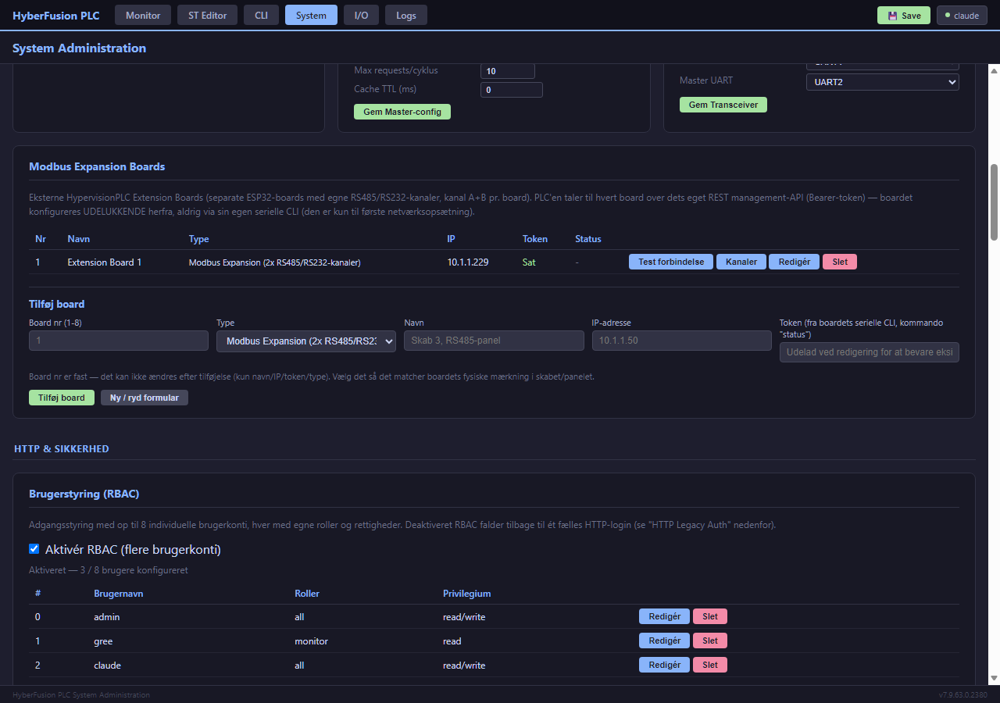

# 6. Modbus-interface

[← 5. CLI/Konsol](05_CLI_Konsol.md) · [Indeks](00_INDEKS.md) · Næste: [7. REST API →](07_REST_API.md)

---

## 6.1 To roller, samme register-lager

Systemet kan samtidig (eller på ES32D26: skiftevis, se [§2.4](02_Hardware_og_Moduler.md#24-modbus-transceiver-delt-vs-dedikeret-uart)) spille to Modbus-roller:

- **Slave** — svarer på forespørgsler fra et overordnet system (SCADA/HMI). Systemet er passivt: det venter på og besvarer requests.
- **Master** — sender selv forespørgsler ud til andre enheder på RS-485-bussen (VFD'er, sensorer, målere) og gemmer deres svar i en intern cache.

Begge roller læser og skriver til det **samme interne register-/coil-lager**, som også er det ST Logic og REST API'et arbejder på. Det er derfor Slave-siden kan eksponere data som Master-siden selv har indsamlet fra andre enheder — systemet fungerer som en Modbus-gateway/aggregator uden ekstra kode.

## 6.2 Understøttede function codes

| FC | Navn | Slave (svarer på) | Master (kan sende) |
|----|------|:---:|:---:|
| 0x01 | Read Coils | ✅ | ✅ |
| 0x02 | Read Discrete Inputs | ✅ | ✅ |
| 0x03 | Read Holding Registers | ✅ | ✅ (inkl. multi-register) |
| 0x04 | Read Input Registers | ✅ | ✅ |
| 0x05 | Write Single Coil | ✅ | ✅ |
| 0x06 | Write Single Register | ✅ | ✅ |
| 0x0F | Write Multiple Coils | ✅ | — |
| 0x10 | Write Multiple Registers | ✅ | ✅ |

Protokol: **Modbus RTU** over RS-485 (framing, CRC16) for systemets egen Slave/Master-rolle beskrevet i dette afsnit. Systemet er derudover også en **Modbus TCP-klient** (MBAP-framing) mod eksterne Modbus Expansion Boards — se [§6.7](#67-modbus-expansion-boards-feat-409).

**Adgangskontrol på RTU-bussen (bevidst fravalg, ikke en overset mangel):** Modbus RTU har pr. protokol-design ingen adgangskontrol på function-code- eller register-niveau — enhver enhed der fysisk er koblet på RS-485-bussen og kender (eller gætter) et slave-ID kan sende læse-/skrive-forespørgsler, inklusive til systemets egne kontrol-registre (fx `ST_LOGIC_CONTROL_REG_BASE`). Dette er en egenskab ved selve RTU som fysisk lag — samme begrænsning gælder ethvert Modbus RTU-slave-udstyr, ikke kun dette system — og løses i praksis ved **fysisk adgangskontrol til bussen** (hvem har adgang til RS-485-kablingen), ikke i software. Samme ræsonnement gælder ST Logic-programmers Modbus Master-kald (`MB_READ_*`/`MB_WRITE_*`): de kan i dag adressere enhver slave 1-247 på bussen uden en indbygget allowlist — men et ST-program kræver i sig selv allerede skriverettighed til at blive uploadet, og en bruger med den rettighed har allerede tilsvarende bus-adgang via `mb write` i CLI'en, så en allowlist ville ikke reelt begrænse en angriber med den adgang.

## 6.3 Register-kapacitet

| Type | Antal | Adresser |
|------|-------|----------|
| Holding Registers | 256 | 0-255 |
| Input Registers | 256 | 0-255 |
| Coils | 256 bits (32 bytes) | 0-255 |
| Discrete Inputs | 256 bits (32 bytes) | 0-255 |

For den **komplette, adresse-for-adresse** oversigt over hvad hvert register betyder (systemregistre, ST Logic-eksporterede variabler, tæller-/timer-mapping, m.m.), brug **Register Map**-siden i web-dashboardet ([§4](04_Web_Dashboard_og_Monitor.md)), som viser den aktuelle, live tildeling. Tællernes faste registerblokke (HR100-174) står i [`../COUNTER_CONFIG_TEMPLATES.md`](../COUNTER_CONFIG_TEMPLATES.md#registre). Den ældre adresse-for-adresse-fil [`MODBUS_REGISTER_MAP.md`](../../archive/docs/MODBUS_REGISTER_MAP.md) ligger i arkivet og er skrevet til v4.7 — brug den kun som baggrund.

Kort orienteringsguide til de vigtigste blokke (se register-map-filen for præcise grænser og eventuelle ændringer):
- **IR 220-251** — ST Logic EXPORT-variabler, synlige som Input Registers for eksterne SCADA-systemer
- **HR 0-17** (ES32D26) — Analog I/O: Vi1-4/Ii1-4 raw+kalibreret værdi, AO1-2 setpoint (se [kapitel 4](04_Web_Dashboard_og_Monitor.md) og `show analog`)
- Dynamisk allokerede registre til tællere, timere og ST Logic-bindings, styret af en intern register-allokator der forhindrer utilsigtet overlap mellem subsystemer

## 6.4 Modbus Slave — konfiguration

```
set modbus-slave enabled on
set modbus-slave slave-id 1        (gyldigt: 1-247, eller 0 for broadcast-modtagelse)
set modbus-slave baudrate 9600
set modbus-slave parity none       (none | even | odd)
set modbus-slave stop-bits 1

show modbus-slave                  (status + løbende statistik)
```

## 6.5 Modbus Master — konfiguration

Master-rollen kører som en **asynkron baggrundstask** med prioritetskø og cache — den blokerer aldrig ST Logic eller andre subsystemer, selv ved langsomme eller udeblevne svar fra eksterne enheder.

```
set modbus-master enabled on
set modbus-master baudrate 9600
set modbus-master timeout 1000            (ms, svartimeout pr. forespørgsel)
set modbus-master max-requests 5          (MB_*-kald per ST-program per scan-cyklus)
set modbus-master cache-ttl 0             (0 = værdier udløber aldrig af sig selv)
set modbus-master cache-size 32           (max unikke (slave,adresse)-kombinationer)
set modbus-master queue-size 16           (max ventende requests)

show modbus-master                        (status + kø-/cache-statistik)
```

**Prioritering:** skrivninger (Write) prioriteres altid over læsninger; blandt læsninger prioriteres "første læsning" (intet cachet endnu) over "opdatering af allerede kendt værdi". Er køen fuld, fortrænges den laveste-prioritets ventende request — se [§13.4](13_Fejlfinding.md#134-modbus-master-holder-op-med-at-opdatere-en-bestemt-adresse) hvis en bestemt adresse holder op med at opdatere.

**Manuelt afprøve Master:** se [`mb read`/`mb write`](05_CLI_Konsol.md#54-mb--modbus-master-fra-kommandolinjen) i CLI-kapitlet, eller vælg **Intern Modbus** som board i I/O-sidens test-panel (under Modbus Expansion Boards, se §6.7).

**Fra ST Logic:** se [kapitel 8](08_ST_Logic_Programmering.md#87-modbus-master-fra-st-logic) for `MB_READ_HOLDING`/`MB_WRITE_HOLDING` m.fl.

**Via web-GUI (FEAT-166):** slave-id/baudrate/paritet/stopbits/inter-frame-delay (Slave) og enabled/baudrate/paritet/stopbits/timeout/inter-frame-delay/max-requests/cache-ttl (Master) kan nu også sættes fra `/system`-siden — samme felter som ovenfor, blot uden CLI. `cache-size`/`queue-size` er ikke inkluderet dér, da de er faste compile-time-kapaciteter (`MB_CACHE_MAX`/`MB_QUEUE_MAX`), ikke runtime-konfigurerbare via REST i dag.

## 6.6 Overvågning af faktisk bustrafik

Både Slave- og Master-siden logges live i **Modbus Aktivitetsloggen** i dashboardet ([§4.2](04_Web_Dashboard_og_Monitor.md)) — et wire-level-vindue der viser hver transaktion uanset hvor den stammer fra (ST Logic, CLI, dashboard, eller en ekstern master der taler til jeres slave). Uvurderligt værktøj når noget "burde virke, men gør ikke" — se [kapitel 13](13_Fejlfinding.md).

## 6.7 Modbus Expansion Boards (FEAT-409)

Et "HypervisionPLC Extension Board" er et separat, fysisk board med sine egne RS485/RS232-kanaler (kanal A + B), som PLC'en administrerer over netværket — al konfiguration og diagnose sker herfra, boardet har ingen egen driftsbrugerflade (kun en engangs seriel opsætning ved installation).

**I/O-siden → "Modbus Expansion Boards"-kortet** (flyttet fra System-siden i v7.9.68.24):

- **Tilføj et board**: et fast **board nr (1-8)** du selv vælger (anbefaling: match fysisk mærkning i skabet/panelet — nummeret kan ikke ændres bagefter, kun fjernes og tilføjes igen), en **type** (i dag kun "Modbus Expansion, 2× RS485/RS232" — flere board-typer, fx rene digitale ind-/udgangs-expansion-boards, forventes tilføjet efterhånden som de findes som fysisk hardware), navn (frit valgt label), IP-adresse, og det Bearer-token boardets serielle opsætnings-CLI viser (kommandoen `status` på boardet selv). Tokenet vises aldrig igen af PLC'en efter det er gemt — hav det klar fra boardets egen skærm.
- **Test forbindelse**: henter boardets live status (firmware-version, oppetid, antal kanaler) — bekræfter at IP og token er korrekte.
- **Kanaler**: viser og redigerer kanal A/B's konfiguration (mode RS485/RS232, baudrate, paritet, stopbits, timeout) direkte fra boardet — ændringer gemmes atomisk (alle felter i ét kald, aldrig delvist). Statistik (antal forespørgsler/fejl) vises live.
- **Firmware** (kolonne, FEAT-420): boardets kørende firmware (`running_version`). Afventer en ny firmware bekræftelse, vises en advarsel med sekunder til automatisk rollback samt knapperne **Bekræft** og **Rul tilbage nu**; blev seneste opdatering rullet tilbage, vises det også.
- **Opdatér firmware…** (FEAT-420): opdaterer boardets firmware fra en `.bin`-fil, se nedenfor.
- **Test funktions-register**: et diagnostisk panel til at afprøve en enkelt Modbus-transaktion (læs/skriv holding-register, coil, osv.) mod en given slave på den valgte kanal — til opsætning/fejlsøgning, ikke til løbende drift. Board-listen har altid **Intern Modbus (PLC'ens RS485)** som sidste valg (FEAT-422, flyttet fra Monitor-sidens Modbus Master-kort): så går transaktionen ud på PLC'ens EGEN RS485-bus via Modbus Master (`/api/modbus/master/rw`, kræver at Master er aktiveret). Kanal-feltet skjules, kun FC01-06 kan vælges, og der læses/skrives én værdi ad gangen gennem samme kø som ST Logic. Hver "Kør" giver en NY bus-transaktion (BUG-425) — "Cache-alder" i svaret er derfor normalt kun få ms; fejl (timeout/CRC/exception) vises direkte. "Funktions-test (capability probe)" findes kun for expansion boards.



**Firmwareopdatering af et board (FEAT-420):** vælg **Opdatér firmware…** ud for boardet og en `.bin`-fil. Browseren tjekker først, at filen er en ESP32-firmware og indeholder Expansion Boardets identitets-markør (PLC'ens egen `.bin` afvises med det samme), og viser en bekræftelsesdialog med nuværende og ny version. Derefter kører PLC'en hele forløbet automatisk, med en fremdriftsbjælke og en tekst pr. trin:

1. **Uploader…** — filen sendes til PLC'en, som streamer den direkte videre til boardet (den gemmes ikke på PLC'en, og browseren taler aldrig med boardet selv — tokenet forlader aldrig PLC'en). En MD5-kontrolsum beregnes i browseren og verificeres af boardet, så en beskadiget overførsel opdages hele vejen.
2. **Genstarter boardet…** — den nye firmware aktiveres. Boardets Modbus-kanaler er utilgængelige i ca. 5-15 s.
3. **Venter på boardet…** — PLC'en spørger hvert 3. sekund (højst 90 s), om den nye firmware kører.
4. **Kontrollerer…** — sundhedstjek: boardets status og kanal-liste skal svare korrekt. Fejler det, ruller PLC'en straks boardet tilbage til den forrige firmware.
5. **Bekræfter…** — først nu bekræftes den nye firmware. En firmware der **ikke** bekræftes inden 10 minutter (eller som crasher ved opstart) ruller boardet selv tilbage — en opdatering kan derfor ikke efterlade et board uden netværk.
6. Kapabiliteter hentes igen, og kanal-config fra før opdateringen genskrives, hvis den nye firmware har ændret den.

Luk ikke siden under selve uploadet (typisk 10-60 s). PLC'ens web-UI er optaget, mens uploadet står på — ligesom ved PLC'ens egen firmwareopdatering. Planlæg opdateringer uden for kritisk drift. Fejlbeskeder viser altid boardets egen forklaring. Lukkes browseren midt i uploadet, kasserer boardet det og kører uændret videre.

**Hostname fra PLC'en (FEAT-455, board-firmware ≥ 0.32.0):** boardets netværksnavn i routeren/DHCP sættes til det navn, boardet er oprettet med her. Bogstaver og tal bevares, alt andet bliver til "-", og navnet afkortes til højst 32 tegn, fx "Skab 007" → `Skab-007`. Det sker:
- når et board **oprettes**, eller når et boards **navn ændres**. Der vises først en advarsel, fordi boardet genstartes bagefter: Ethernet tager først et nyt hostname ved opstart, og det giver ca. 5–10 s uden data fra boardet.
- manuelt med knappen **Hostname** ud for boardet, eller `mbx <board> hostname` i CLI'en.

Ældre board-firmware uden funktionen giver fejlen "opdatér til 0.32.0 eller nyere".

**Overvågning af boards (FEAT-456/457/458):**
- **Alarmer:** Et board, der går offline, giver en KRIT-alarm i Alarm Historik (`/logs#alarm`) og vises i ALARM-banneret. Offline betyder intet Modbus TCP-svar i 60 s og intet sundhedstjek i 150 s. Når boardet er tilbage, kommer en INFO-alarm. En kanal med over 20 % timeouts i et minut (mindst 10 kald) giver en ADV-alarm, højst én pr. kanal pr. 10 min.
- **Kanalstatistik:** Dashboardets "Modbus Expansion Boards"-kort viser en linje pr. kanal under hvert board med kald pr. sekund, OK-procent og antal timeouts. Det er PLC'ens eget syn på den trafik, ST Logic laver.
- **Timeout:** PLC'en henter hvert 5. minut boardets kanalopsætning og venter boardets kanal-timeout + 300 ms (mindst 800 ms, højst 5 s) på et svar. Så giver PLC'en ikke op, mens boardet stadig venter på slaven.
- **Metrics:** `expansion_board_online{board}`, `mbx_channel_requests_total`/`_ok_total`/`_timeouts_total`/`_exceptions_total`/`_errors_total`/`_last_ok_age_ms`/`_timeout_ms`/`_board_timeout_ms` `{board,channel}`.

**Styring af boardet fra PLC'en (FEAT-462–465, board-firmware ≥ 0.34.0):**
- **PLC-IP:** Boardet afviser Modbus TCP fra alle andre end sin PLC-IP. Knappen **PLC-IP** sætter den til PLC'ens aktuelle IP (Ethernet, ellers WiFi). Er den forkert, fx efter et modulskift med ny IP, vises "⚠ Boardets PLC-IP er …" med knappen **Ret PLC-IP**, og der kommer en ADV-alarm.
- **Syslog…:** Sætter boardets syslog-modtager (IP, port, tag, level 1–8) eller fjerner alle modtagere.
- **Token afvist:** Svarer boardet 401 på PLC'ens sundhedstjek, vises "⚠ Token afvist", og der kommer en KRIT-alarm. Ret tokenet under **Redigér**.
- **Kopi og Genskab:** PLC'en henter hvert 5. minut boardets opsætning (`GET /api/config`: kanaler, PLC-IP, hostname, syslog; aldrig token eller kodeord). Kopien kommer med i PLC'ens backup. **Genskab** skriver den tilbage til boardet, fx efter udskiftning: kanaler, PLC-IP = PLC'ens aktuelle IP, syslog og hostname. Bagefter genstartes boardet med advarsel. Kopien opdateres kun fra et board, der er sat op (har en PLC-IP), så et nyt, tomt board ikke overskriver den.
- **Opdatér alle boards…:** Én firmwarefil til alle boards, ét ad gangen. Boards, der allerede kører versionen, springes over. Kører boardene forskellige versioner, vises en advarsel.

**Kontinuerlig datatrafik i ST Logic (FEAT-410):** den løbende, høj-frekvente Modbus-trafik mod feltbusserne bag et expansion-board går via Modbus TCP direkte til boardet (ikke gennem PLC'ens web-UI), og kan læses/skrives fra ST Logic-programmer med `MBX_*`-funktionsfamilien — samme non-blocking cache/kø-mønster som den lokale RS485-bus' `MB_*`-funktioner (se [Appendiks D.5.9b](D_ST_Logic_Funktionsreference.md#d59b-modbus-expansion-board-mbx_-feat-410)), blot med et ekstra `board`- og `kanal`-argument foran. **v7.9.68.0:** multi-register/coil WRITE tilføjet (`MBX_WRITE_HOLDINGS`/FC16, `MBX_WRITE_COILS`/FC15) — og multi-**read** (`arr := MBX_READ_HOLDINGS(board, kanal, slave, addr, count)`, FC03, op til 16 registre i én transaktion) fra v7.9.68.94 (FEAT-461). Kø/cache-diagnostik: `show modbus-expansion queue` (se [Appendiks A](A_CLI_Kommando_Reference.md#modbus-expansion-board-feat-409)).

**Dashboard-badge (Monitor):** Dashboardet ([kapitel 4](04_Web_Dashboard_og_Monitor.md)) har et tilsvarende "Modbus Expansion Boards"-kort med et online/offline-badge pr. board (grøn = online + fw-version/kanaltal, rød = offline, grå = endnu ikke tjekket), plus et samlet "N/M online"-badge i kort-overskriften. Boards tjekkes automatisk hvert 30. sekund, så længe dashboardet er åbent i en browser — luk fanen, og pollingen stopper (enheden selv ringer aldrig ud af sig selv uopfordret).

**CLI:** se [Appendiks A](A_CLI_Kommando_Reference.md#modbus-expansion-board-feat-409) for `set modbus-expansion`/`show modbus-expansion`/`mbx`-kommandoerne.
**REST API:** se [Appendiks B](B_REST_API_Reference.md#modbus-expansion-board-feat-409).

---

[← 5. CLI/Konsol](05_CLI_Konsol.md) · [Indeks](00_INDEKS.md) · Næste: [7. REST API →](07_REST_API.md)
