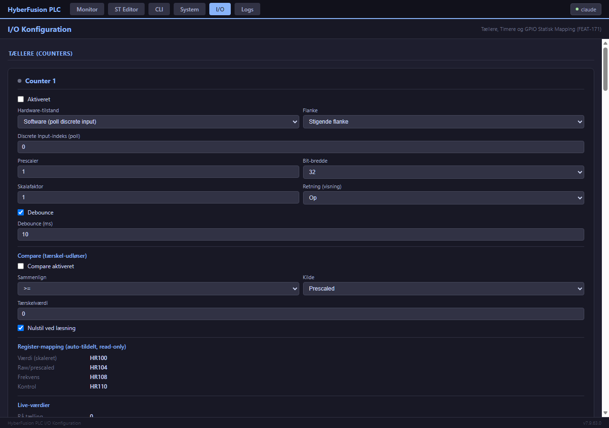

# 9. Tællere & Timere

[← 8. ST Logic](08_ST_Logic_Programmering.md) · [Indeks](00_INDEKS.md) · Næste: [10. Sikkerhed →](10_Sikkerhed_og_Adgangsstyring.md)

---

Ud over ST Logic's egne `TON`/`TOF`/`TP`/`CTU`/`CTD`/`CTUD`-funktionsblokke ([§8.5](08_ST_Logic_Programmering.md#85-indbyggede-funktioner-overblik)) har systemet **4 dedikerede hardware-nære tællere** og **4 dedikerede timere**, hver med egen konfiguration, egne Modbus-registre og egen statistik — uafhængige af om ST Logic overhovedet er aktiveret. De er tænkt til situationer hvor man vil have en tæller/timer der kører selvstændigt og er direkte tilgængelig for et SCADA-system, uden at skulle skrive ST-kode først.

## 9.1 Tællere — tre driftstilstande

| Tilstand | CLI-værdi | Beskrivelse | Præcision |
|----------|-----------|--------------|-----------|
| **Software (polling)** | `sw` | Læser en digital indgang i hovedløkken | God til lave frekvenser, kan tabe hurtige pulser |
| **Software + interrupt** | `sw-isr` | Tæller via GPIO-interrupt | Fanger hurtigere pulser end ren polling |
| **Hardware (PCNT)** | `hw` | Bruger ESP32'ens indbyggede pulse-counter-hardware | Højeste præcision, ingen software-overhead |

> **ES32D26:** hardware-tællerens interrupt-pins er ikke tilgængelige på dette board (se [§2.2](02_Hardware_og_Moduler.md)) — kun `sw`/`sw-isr` kan bruges der.

**Konfiguration:**
```
set counter 1 mode sw
set counter 1 input-dis 1          (bind til digital indgang 1)
set counter 1 start-value 0
show counter 1 verbose
```

Tællerne understøtter op- og nedtælling, kompareringsfunktion (udløs en output/coil når tælleren krydser en tærskel — se [`../COUNTER_COMPARE_QUICK_START.md`](../COUNTER_COMPARE_QUICK_START.md) og [`../COUNTER_COMPARE_REFERENCE.md`](../COUNTER_COMPARE_REFERENCE.md)) samt frekvensmåling (`CNT_FREQ`-funktionen fra ST Logic, eller `show counter <id> verbose`).

## 9.2 Timere — fire driftstilstande

| Mode | Navn | Beskrivelse |
|------|------|-------------|
| **1** | One-shot | Kører gennem op til 3 faser med hver sin varighed og output-tilstand, én gang pr. udløsning |
| **2** | Monostable | Ét puls-output med fast varighed, genudløses ved trigger |
| **3** | Astable | Vedvarende on/off-cyklus med separat on- og off-varighed (firkantbølge) |
| **4** | Input-triggered | Aktiveres af en digital indgang (eller Modbus-coil), med konfigurerbar forsinkelse og flanke-detektion |

**Konfiguration (eksempel: Mode 3, astabel 1s/1s-blink):**
```
set timer 1 mode 3
set timer 1 on-duration 1000
set timer 1 off-duration 1000
set timer 1 enabled on
show timer 1 verbose
```

## 9.3 Tilgængelighed fra Modbus og ST Logic

Alle 4 tælleres og 4 timeres værdier og styre-/statusbits er tilgængelige som Modbus-registre — se [`../../MODBUS_REGISTER_MAP.md`](../../MODBUS_REGISTER_MAP.md) for de præcise adresser. De kan desuden læses og styres direkte fra ST Logic (`CNT_VALUE`, `CNT_CTRL`, `CNT_ENABLE` m.fl. — se [§8.5](08_ST_Logic_Programmering.md#85-indbyggede-funktioner-overblik)), så et program kan reagere på en tællerværdi uden at gå vejen om Modbus-registrene.

## 9.4 Konfigurationsskabeloner

For hurtig opsætning af almindelige scenarier (pulstælling, flowmåling, pumpecyklustæller m.fl.), se [`../COUNTER_CONFIG_TEMPLATES.md`](../COUNTER_CONFIG_TEMPLATES.md).

## 9.5 Web-GUI (FEAT-171)

Alle 4 tællere og 4 timere kan også konfigureres via web-GUI'en på **`/io`** (link i topnavigationen ved siden af "System") — samme felter som CLI'en, inkl. driftstilstand, register-mapping (vist read-only — auto-tildelt, ikke redigerbar, samme begrænsning som CLI'en har bevidst), compare-tærskler og live-værdier (rå tælling, skaleret værdi, frekvens, kørselsstatus). Start/Stop/Reset-knapper virker direkte mod tælleren/timeren uden at skulle skrive Modbus-registre manuelt. GPIO statisk mapping (§2 — pin↔register/coil-binding, adskilt fra tæller/timer-hardwarebindinger) har sin egen sektion på samme side, med en pin-vælger der kun tilbyder gyldige/ikke-reserverede pins for det aktive board.



---

[← 8. ST Logic](08_ST_Logic_Programmering.md) · [Indeks](00_INDEKS.md) · Næste: [10. Sikkerhed →](10_Sikkerhed_og_Adgangsstyring.md)
