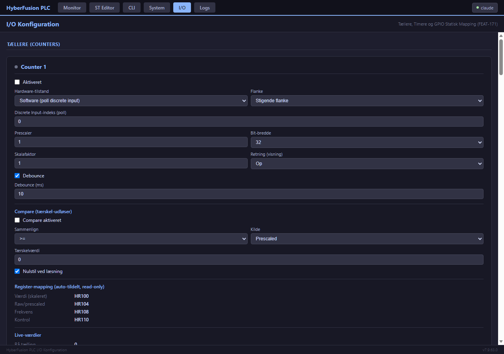

# 9. Tællere & Timere

[← 8. ST Logic](08_ST_Logic_Programmering.md) · [Indeks](00_INDEKS.md) · Næste: [10. Sikkerhed →](10_Sikkerhed_og_Adgangsstyring.md)

---

Ud over ST Logic's egne `TON`/`TOF`/`TP`/`CTU`/`CTD`/`CTUD`-funktionsblokke ([§8.5](08_ST_Logic_Programmering.md#85-indbyggede-funktioner-overblik)) har systemet **4 dedikerede hardware-nære tællere** og **4 dedikerede timere**, hver med egen konfiguration, egne Modbus-registre og egen statistik — uafhængige af om ST Logic overhovedet er aktiveret. De er tænkt til situationer hvor man vil have en tæller/timer der kører selvstændigt og er direkte tilgængelig for et SCADA-system, uden at skulle skrive ST-kode først.

## 9.1 Tællere — tre driftstilstande

| Tilstand | CLI-værdi | Beskrivelse | Præcision |
|----------|-----------|--------------|-----------|
| **Software (polling)** | `sw` | Læser en digital indgang i hovedløkken | God til lave frekvenser, kan tabe hurtige pulser |
| **Software + interrupt** | `sw-isr` | Tæller via GPIO-interrupt | Fanger hurtigere pulser end ren polling |
| **Hardware (PCNT)** | `hw` | Bruger ESP32'ens indbyggede pulse-counter-hardware | Højeste præcision, ingen software-overhead |

> **ES32D26:** kun `sw` (polling af en discrete input) kan bruges. DI1–8 sidder bag et skifteregister (74HC165), så hverken GPIO-interrupt (`sw-isr`) eller hardware-tælleren (`hw`/PCNT) kan se dem, og de frie ESP32-pins bruges af W5500/PSRAM. Fra v7.9.68.46 (FEAT-430) er `sw-isr` og `hw` derfor spærret på dette board: CLI og REST afviser dem med en forklaring, I/O-siden viser dem gråt med en bemærkning, `CNT_SETUP` returnerer FALSE, og en ældre/gendannet konfiguration med dem sættes til `sw`. Timerne er ren software og virker uændret.

**Konfiguration** (hele tællerens opsætning på **én** linje — se nedenfor):
```
set counter 1 mode 1 hw-mode:sw input-dis:7 edge:falling bit-width:32 start-value:0 prescaler:1 scale:1.0 debounce:on debounce-ms:10
set counter 1 control auto-start:on running:on   (start nu OG efter hver genstart)
save
show counter 1
```

> **Én `set counter … mode 1`-linje = hele konfigurationen.** Hver linje bygger tællerens opsætning op fra standardværdierne; nøgler der ikke står på linjen, får standardværdien (undtagen auto-start, som bevares). Del derfor ikke opsætningen over flere `set counter … mode 1`-linjer — den sidste overskriver de forrige. `control …`-linjen er separat og ændrer kun start/stop/auto-start. `show config counter` viser linjerne i et format, der kan sættes direkte ind igen.

> **Aktiveret er ikke det samme som kørende.** En tæller tæller først, når den er *startet* (`running`, bit 7 i kontrolregistret — `control running:on`, Start-knappen på I/O-siden eller `CNT_CTRL`). Med **auto-start** (`control auto-start:on` eller "Start automatisk ved opstart" på I/O-siden) starter den af sig selv efter hver genstart. Før v7.9.68.47 blev auto-start aldrig gemt, så en tæller stod stille efter genstart (BUG-445).

Tællerne understøtter op- og nedtælling, kompareringsfunktion (udløs en output/coil når tælleren krydser en tærskel — se [`../COUNTER_COMPARE_QUICK_START.md`](../COUNTER_COMPARE_QUICK_START.md) og [`../COUNTER_COMPARE_REFERENCE.md`](../COUNTER_COMPARE_REFERENCE.md)) samt frekvensmåling (`CNT_FREQ`-funktionen fra ST Logic, eller `show counter <id> verbose`).

### 9.1.1 Sådan hænger tælling, startværdi, prescaler og skala sammen

Tælleren har **én intern tælleværdi i pulser**. Prescaler og skala ændrer *ikke* tællingen — de bestemmer kun, hvad der skrives i de to udgangsregistre:

```
  Indgang (fx DI8 = discrete input 7)
        │
        ▼
  ┌───────────────────────────────┐
  │ Flanke + debounce             │  edge: rising | falling | both
  │                               │  debounce:on (debounce-ms) | off
  └───────────────┬───────────────┘
                  │  én puls pr. godkendt flanke — kun når tælleren KØRER
                  ▼                                   (running / auto-start)
  ┌──────────────────────────────────────────────┐
  │ TÆLLEVÆRDI  (intern, i pulser)               │
  │  reset counter / opstart  →  start-value     │──► HR108  frekvens (Hz)
  │  direction:up    →  +1 pr. puls              │    pulser/s — UDEN prescaler
  │  direction:down  →  −1 pr. puls              │
  │  bit-width = loft (8/16/32/64 bit):          │──► HR110  ctrl, bit 3 = overflow
  │   op:  forbi maks.  →  forfra fra start-value│
  │   ned: forbi 0      →  start-value           │
  └───────────────┬──────────────────┬───────────┘
                  │                  │
             × scale          ÷ prescaler (heltal, rundes ned)
                  │                  │
                  ▼                  ▼
          HR100-101  "værdi"    HR104-105  "prescaled"
          CNT_VALUE(1)          CNT_RAW(1)
          show: Scaled Value    show: Prescaled Value · REST-feltet "raw"

  compare-source vælger hvad compare-value sammenlignes med:
     0 = tælleværdien   1 = prescaled (HR104)   2 = scaled (HR100)
```

| Begreb | Gælder for | Betydning |
|---|---|---|
| **start-value** | tælleværdien (pulser) | Værdien ved `reset counter`, ved opstart og ved overløb. Den er i **pulser** — ikke i prescalerede eller skalerede enheder |
| **direction** | tælleværdien | `up` +1 pr. puls, `down` −1 pr. puls |
| **bit-width** | tælleværdien | Loftet før overløb: 8/16/32/64 bit. Antal registre pr. udgang: 1 (≤16 bit), 2 (32 bit), 4 (64 bit) — lavt ord først |
| **prescaler** | kun HR104-105 | Tælleværdien ÷ prescaler (heltal). Springer **ingen** pulser over og udvider ikke tællerens område |
| **scale** | kun HR100-101 / `CNT_VALUE` | Tælleværdien × scale, afrundet |
| **frekvens** | HR108 | Pulser pr. sekund, uden prescaler og skala |

**Eksempel** — `start-value:50 prescaler:100 scale:1.0 direction:up`:

| Pulser talt efter `reset counter` | Tælleværdi | HR100 / `CNT_VALUE` (× 1,0) | HR104 / `CNT_RAW` (÷ 100) |
|---|---|---|---|
| 0 | 50 | 50 | **0** |
| 49 | 99 | 99 | 0 |
| 50 | 100 | 100 | **1** |
| 950 | 1000 | 1000 | 10 |
| 1950 | 2000 | 2000 | 20 |

Med `scale:0.5` i stedet ville HR100 vise 25, 50, 500, 1000 — HR104 er uændret.

**Typiske valg**

- *Flowmåler med 100 pulser pr. liter:* `prescaler:100` → HR104 viser hele liter, HR100 pulser. Eller `scale:0.01` → HR100 viser liter (afrundet).
- *Skal HR104 starte på et bestemt tal?* Sæt startværdien i pulser: HR104 = 50 ved `prescaler:100` kræver `start-value:5000`.
- *Nedtælling fra en mængde:* `direction:down start-value:500` → tæller 500, 499, … 0; ved næste puls tilbage til 500 og overflow-bit (ctrl bit 3) sættes.

> **Navneforvirring:** `show counter` kalder den interne tælleværdi "Raw Value", mens REST-feltet `raw` (`GET /api/counters/{id}`) er HR104 = den *prescalerede* værdi. Registeret HR104 hedder internt `raw_reg`. Tænk "HR104 = prescaled".

## 9.2 Timere — fire driftstilstande

| Mode | Navn | Beskrivelse |
|------|------|-------------|
| **1** | One-shot | Kører gennem op til 3 faser med hver sin varighed og output-tilstand, én gang pr. udløsning |
| **2** | Monostable | Ét puls-output med fast varighed, genudløses ved trigger |
| **3** | Astable | Vedvarende on/off-cyklus med separat on- og off-varighed (firkantbølge) |
| **4** | Input-triggered | Aktiveres af en digital indgang (eller Modbus-coil), med konfigurerbar forsinkelse og flanke-detektion |

**Konfiguration (eksempel: Mode 3, astabel 1s/1s-blink på coil 150):**
```
set timer 1 mode 3 on-ms:1000 off-ms:1000 p1-output:1 p2-output:0 output-coil:150
save
show timer 1
```
Som for tællerne er én `set timer … mode N`-linje hele timerens opsætning; `set timer <id> disable` sletter den.

## 9.3 Tilgængelighed fra Modbus og ST Logic

Alle 4 tælleres og 4 timeres værdier og styre-/statusbits er tilgængelige som Modbus-registre — se registertabellen i [`../COUNTER_CONFIG_TEMPLATES.md`](../COUNTER_CONFIG_TEMPLATES.md#registre) for de præcise adresser. De kan desuden læses og styres direkte fra ST Logic (`CNT_VALUE`, `CNT_CTRL`, `CNT_ENABLE` m.fl. — se [§8.5](08_ST_Logic_Programmering.md#85-indbyggede-funktioner-overblik)), så et program kan reagere på en tællerværdi uden at gå vejen om Modbus-registrene.

**Spejling til en anden adresse (DYNAMIC):** skal en Modbus-master læse en tællers værdi på en bestemt adresse, kan den spejles dertil:

```
set holding-reg DYNAMIC 90 counter1:index     (også raw, freq, overflow, ctrl)
set coil DYNAMIC 10 counter1:overflow
save
```

Spejlingen er de laveste 16 bit — læs tællerens egne registre (HR100+) for den fulde 32/64-bit værdi. Adresse 200–237 afvises (ST Logics kontrolregistre). Fjern en spejling med `no set holding-reg <adr>` / `no set coil <adr>`. Før v7.9.68.44 blev DYNAMIC-registre med tæller-kilde aldrig opdateret (BUG-434).

**Slet en tæller/timer:** `no set counter <id>` / `no set timer <id>` (eller web/REST `DELETE`), efterfulgt af `save`. Tællerens registre frigives, så den kan sættes op igen med det samme. Før v7.9.68.44 overlevede en sletning ikke en genstart, en tæller sat op fra web blev aldrig gemt, og en aktiv tæller kunne ikke omkonfigureres efter en genstart (BUG-439/442).

## 9.4 Konfigurationsskabeloner

For hurtig opsætning af almindelige scenarier (pulstælling, flowmåling, pumpecyklustæller m.fl.), se [`../COUNTER_CONFIG_TEMPLATES.md`](../COUNTER_CONFIG_TEMPLATES.md).

## 9.5 Web-GUI (FEAT-171)

Alle 4 tællere og 4 timere kan også konfigureres via web-GUI'en på **`/io`** (link i topnavigationen ved siden af "System") — samme felter som CLI'en, inkl. driftstilstand, register-mapping (vist read-only — auto-tildelt, ikke redigerbar, samme begrænsning som CLI'en har bevidst), compare-tærskler og live-værdier (rå tælling, skaleret værdi, frekvens, kørselsstatus). Start/Stop/Reset-knapper virker direkte mod tælleren/timeren uden at skulle skrive Modbus-registre manuelt. GPIO statisk mapping (§2 — pin↔register/coil-binding, adskilt fra tæller/timer-hardwarebindinger) har sin egen sektion på samme side, med en pin-vælger der kun tilbyder gyldige/ikke-reserverede pins for det aktive board.



---

[← 8. ST Logic](08_ST_Logic_Programmering.md) · [Indeks](00_INDEKS.md) · Næste: [10. Sikkerhed →](10_Sikkerhed_og_Adgangsstyring.md)
