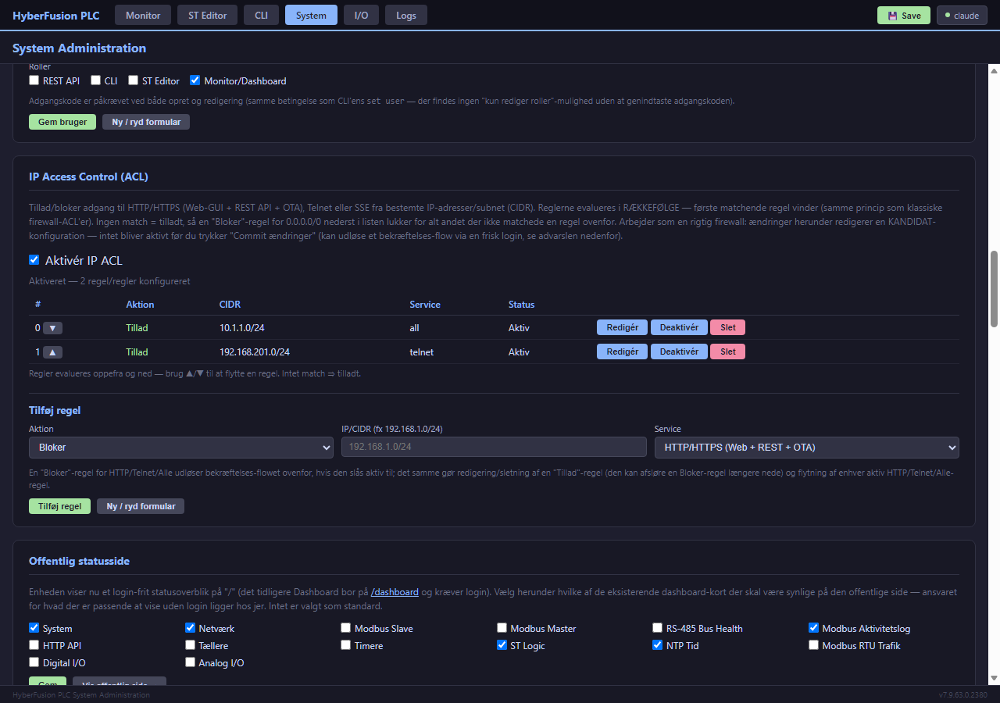

# 10. Sikkerhed & Adgangsstyring

[← 9. Tællere & Timere](09_Taellere_og_Timere.md) · [Indeks](00_INDEKS.md) · Næste: [11. Backup/Restore & Firmware →](11_Backup_Restore_og_Firmware.md)

---

> Dette kapitel dækker sikkerheds*funktioner* i systemet. For løbende status over kendte, endnu-uafhjulpne sikkerhedspunkter, se den separat vedligeholdte [`../../SECURITY_INDEX.md`](../../SECURITY_INDEX.md) — den bør konsulteres før enhver produktionsudrulning.

## 10.1 To adgangsmodeller

Systemet har to adgangs-modeller, valgt globalt:

- **Legacy-mode** (RBAC deaktiveret) — ét fælles brugernavn/adgangskode pr. grænseflade (HTTP, telnet). Simpelt, men ingen differentiering mellem brugere.
- **RBAC-mode** (Role-Based Access Control) — op til 8 navngivne brugerkonti, hver med sin egen kombination af **roller** og **privilegie**.

Aktivér RBAC:
```
set rbac enable
set user tekniker password <kodeord> roles api,cli,monitor privilege read/write
set user overvaagning password <kodeord> roles monitor privilege read
```

> **Fald-i-baglås-advarsel:** aktivér ikke RBAC før mindst én bruger med tilstrækkelige rettigheder er oprettet — CLI'en advarer om dette, men dobbelttjek altid før I logger ud af den session der aktiverer det.

**Brugerstyring via web-GUI (FEAT-166):** samme funktionalitet findes nu også på `/system`-siden under "Brugerstyring" — til/fra for RBAC, tabel over eksisterende brugere, samt en formular til at oprette/redigere/slette brugere (roller som afkrydsningsfelter, privilegium som dropdown). Adgangskode skal genindtastes ved enhver redigering, også hvis kun roller/privilegium ændres — samme betingelse som CLI'ens `set user`, der heller ikke tilbyder en "kun rediger roller"-mulighed. De nye REST-endpoints (`GET/POST /api/rbac`, `POST /api/rbac/users`, `DELETE /api/rbac/users/{navn}`) kræver skriverettighed, bevidst samme grænse som CLI'en allerede har (se [`../../SECURITY_INDEX.md`](../../SECURITY_INDEX.md) #18) — ikke en strengere model, blot samme adgang et andet sted fra.

## 10.2 Roller og privilegier

| Rolle | Giver adgang til |
|-------|-------------------|
| `api` | REST API-endpoints (`/api/*`) |
| `cli` | CLI-kommandoer (seriel, telnet, web-CLI) |
| `editor` | ST Logic-editoren (`/editor`) |
| `monitor` | Dashboard/monitor (`/dashboard` — den offentlige `/`-statusside, FEAT-407, kræver intet login/rolle overhovedet) |

| Privilegie | Betydning |
|------------|-----------|
| `read` | Kan se/hente data (GET, `show`-kommandoer) |
| `write` | Kan ændre noget (POST/DELETE, `set`-kommandoer) |
| `read/write` (`rw`) | Begge dele |

En bruger med kun `monitor`+`read` kan altså se `/dashboard`, men hverken skrive konfiguration eller bruge CLI'en.


## 10.3 Standard-credentials — SKAL ændres

| Grænseflade | Standard-bruger | Standard-kodeord |
|-------------|------------------|---------------------|
| HTTP/dashboard | `admin` | `modbus123` |
| Telnet | `admin` | `telnet123` |

Disse er fabriksstandarder, dokumenteret i selve kildekoden — enhver med adgang til firmwaren (eller til denne manual) kender dem. **Skift dem ved installation**, se [§3.6](03_Installation_og_Foerste_Opstart.md#haerdning-efter-installation) — eller nu også via `/system`-sidens "HTTP Legacy Auth"- og "Telnet"-kort (FEAT-166), som alternativ til CLI'ens `set http password`/`set telnet password`.

**Password-lagring (BUG-352, fra v7.9.10.9):** HTTP/dashboard- og RBAC-brugerpasswords gemmes **hashet** (SHA-256 + et unikt, tilfældigt 16-byte salt pr. konto) — ikke længere i klartekst i NVS. En NVS-backup-eksport eller fysisk flash-dump afslører derfor ikke længere passwords direkte. **Undtagelser, bevidst uændrede:** WiFi-passwordet skal forblive klartekst (kræves af WPA2-håndtrykket mod radioen) og Telnet-passwordet er et separat, selvstændigt credential-system der endnu ikke er omfattet — begge er stadig synlige i en backup-eksport. Ændringen er transparent for eksisterende brugere: et allerede sat password bliver automatisk hashet ved første opstart efter opdateringen, uden at skulle sættes igen.

**Session-tokens (BUG-353, fra v7.9.10.10):** Web-UI'et (dashboard, editor, system, web-CLI, OTA-siden) gensender ikke længere brugernavn/kodeord på hvert request. Login (`POST /api/login`) verificerer én gang og udsteder et kortlivet token — med et **glidende 30-minutters inaktivitets-timeout** (en aktiv fane logges ikke ud, en glemt fane gør efter 30 min uden aktivitet). Log ud (`POST /api/logout`) invaliderer token'et med det samme på enheden.

**Levering til browseren — HttpOnly session-cookie, ikke JS-håndteret token (BUG-393, arkitekturændring fra v7.9.30.0):** de 7 web-UI-sider gemmer IKKE selv token'et (hverken i `localStorage` eller ved manuelt at sætte en `Authorization`-header) — `POST /api/login` sætter i stedet `Set-Cookie: hfplc_session=<token>; HttpOnly; SameSite=Lax`, som browseren derefter sender helt automatisk på alle efterfølgende kald, uden at JavaScript nogensinde kan læse eller miste den. Baggrunden var en dyb, gentagen iOS Safari-fejlklasse (privat browsing, baggrunds-genindlæsning, "Føj til hjemmeskærm" m.fl.) hvor en JS-håndteret token systematisk gik tabt eller blev forvirret af browserens egen tilstand — en HttpOnly-cookie er strukturelt immun over for hele den fejlklasse. `curl`/Node-RED/script-integrationer, der selv sender en `Authorization: Bearer <token>`-header (se §10.3.1 nedenfor), er upåvirkede og fungerer præcis som før — cookien er udelukkende en ekstra, automatisk leveringsvej for browserens egne 7 sider.

### 10.3.1 Auth-metode: None / Basic / Bearer (FEAT-397h, fra v7.9.42.0)

**Baggrund:** Almindelig HTTP Basic Auth har én strukturel svaghed en session-cookie ikke har — browsere (bekræftet: Firefox) cacher Basic-Auth-credentials i en intern, per-browser-proces credential-butik, helt adskilt fra password manager'en, uden nogen JavaScript-API til at rydde den programmatisk. Denne cache overlever både enhedens reboots (som ellers korrekt invaliderer serverens session-cookie) og et eksplicit tryk på "Log ud" i selve web-UI'et — en bruger kan derfor opleve at forblive "logget ind" i browseren uden nogensinde at se en login-boks, selvom serveren rent faktisk har glemt sessionen. Dette er ikke en fejl i selve implementeringen, men en grundlæggende egenskab ved HTTP Basic Auth som protokol.

Der findes derfor tre valgbare auth-metoder (`set http auth-mode basic|bearer`, eller `/system`-sidens "HTTP & Sikkerhed"-kort), der styrer hvilke credential-typer der accepteres NÅR auth i det hele taget er slået til (`auth_enabled`, se ovenfor):

| Metode | Basic-Auth (`-u bruger:pass`) | Bearer-token/session-cookie | Anbefales til |
|--------|-------------------------------|------------------------------|---------------|
| `none` (`auth_enabled=off`) | — (intet krav) | — (intet krav) | Isolerede test-/labnetværk uden adgangskrav |
| `basic` | ✅ Accepteret | ✅ Accepteret | Ældre integrationer der endnu ikke understøtter et login-trin |
| `bearer` (**standard**) | ❌ Afvist (401) — undtagen selve `/api/login` | ✅ Accepteret | Nye opsætninger, og enhver installation der er tilgængelig fra en delt/almindelig browser |

**`bearer`-tilstand lukker cache-problemet strukturelt**: enhver Basic-Auth-header afvises aktivt med 401 på ALLE endpoints undtagen `/api/login` selv (som af nødvendighed altid skal acceptere Basic-encodede credentials — det ER selve formålet med login-kaldet, at bytte dem til et Bearer-token). En browser kan derfor ikke længere "usynligt" forblive logget ind efter et logout eller en reboot — den tvinges til at gå igennem den rigtige login-boks igen, som herefter korrekt udsteder og respekterer session-cookien/token'et.

**Migrering af eksisterende curl/Node-RED-scripts fra `basic` til `bearer`:** i stedet for at sende `-u bruger:pass` på hvert kald, hent først et token:
```
TOKEN=$(curl -s -u bruger:pass -X POST http://<enhed>/api/login | jq -r .token)
curl -H "Authorization: Bearer $TOKEN" http://<enhed>/api/logic/1
```
Tokenet er kortlivet (samme 30-minutters glidende inaktivitets-timeout som web-UI'et) — et script der kører længe bør genhente et nyt token ved en 401, i stedet for at hente ét én gang for altid.

**Fabriksnye enheder OG allerede-konfigurerede enheder der opgraderes til v7.9.42.0+ sættes begge til `bearer`** — dette var et bevidst valg (ikke "bevar Basic som sikrere/mindre-indgribende default") for at lukke cache-problemet med det samme, også for eksisterende installationer. Skift tilbage til `basic` er muligt hvis eksterne integrationer endnu ikke er klar til token-flowet.

## 10.4 Transportkryptering (HTTPS/TLS)

Systemet understøtter HTTPS via ESP-IDF's indbyggede TLS-server:
```
set http tls on             (kræver reboot)
set http https-port 443     (valgfrit — 443 er default)
```
Eller i web-GUI'en: `/system` → kortet "HTTPS / TLS".

**Vigtigt (BUG-350, fra v7.9.10.8): HTTPS lytter på sin egen, dedikerede port — som standard 443, adskilt fra HTTP's port (som standard 80).** De to porte er uafhængige af hinanden, styret af hhv. `set http port` og `set http https-port`. Før v7.9.10.8 delte HTTPS samme portnummer som HTTP, hvilket betød at aktivering af TLS gjorde HTTP-porten om til en TLS-only-lytter uden varsel — enhver klient der stadig sendte almindelig `http://` mod den port (browser-bogmarker, Node-RED, åbne dashboard-faner) fik en `mbedtls_ssl_handshake returned -0x7900` ("bad ClientHello")-fejlflod, og `https://` uden eksplicit portnummer ramte slet ikke serveren (browsere antager port 443 for https-skemaet, ikke 80). **Efter aktivering skal du derfor besøge `https://<enhedens-ip>:443/`** (eller den port du selv har sat) — ikke bare skifte `http://` til `https://` på samme URL som før.

**Vigtige forbehold, læs før aktivering:**
- Alle enheder bygget fra samme firmware **deler samme selvsignerede certifikat og private nøgle** (embeddet ved kompilering) — det giver kryptering på ledningen, men *ikke* enheds-unik identitet. Kompromitteres én enheds firmware, er nøglen kendt for alle enheder på samme build.
- Browseren vil vise en sikkerhedsadvarsel (selvsigneret certifikat) ved hvert besøg, medmindre certifikatet eksplicit tilføjes som tillid i browseren/OS'et.
- **SSE-strømmen (real-time push til dashboardet) krypteres ikke af `http tls`** — den kører på sin egen, separate raw-TCP-forbindelse. Med TLS aktiveret er dashboardets sider krypteret, men live-datastrømmen er det ikke. Se [`../../SECURITY_INDEX.md`](../../SECURITY_INDEX.md) for status.

## 10.5 Telnet vs. Web-CLI

Telnet (port 23) er ukrypteret klartekst — credentials og kommandoer kan aflyttes af enhver med adgang til det samme netværkssegment. Hvis fjernadgang til CLI er nødvendig, og netværket ikke er fysisk isoleret/tillidsfuldt, **foretræk web-CLI'en over HTTPS** (`/cli`, se [§4.4](04_Web_Dashboard_og_Monitor.md#44-web-cli-cli)) i stedet.

Telnet har en indbygget brute-force-lockout (3 fejlede loginforsøg → 30 sekunders spærring), der er bevaret på tværs af reconnect fra og med v7.9.7.7.

## 10.6 Rate limiting

Alle REST API-kald er rate-limited pr. klient-IP (se [§7.3](07_REST_API.md#73-rate-limiting)) — beskytter mod utilsigtet eller ondsindet overbelastning af API'et, men er ikke i sig selv en erstatning for autentificering.

## 10.7 IP Access Control List (FEAT-399/401/402)



Ud over autentificering (hvem er du) kan enheden begrænse **hvilke IP-adresser/subnet der overhovedet må forsøge at tale med hvilke netværkstjenester** — HTTP/HTTPS (Web-GUI + REST API + OTA), Telnet (CLI) og/eller SSE (dashboardets real-time push). Modbus RTU er bevidst udenfor scope (seriel/RS-485, intet IP-koncept).

**Model: ordnet firewall, første match vinder (samme princip som Cisco/iptables/pf-ACL'er).** Hver regel har en CIDR (`192.168.1.0/24`, eller `/32` for én enkelt host), en tjeneste (`http`/`telnet`/`sse`/`all`) og en aktion — **Tillad** eller **Bloker**. Reglerne evalueres i rækkefølge (index 0, 1, 2, …); den FØRSTE regel der matcher både tjeneste og kilde-IP vinder, og dens aktion afgør udfaldet. Matcher ingen regel, er resultatet **tilladt** — der er ingen implicit "bloker alt andet"-systemdefault, så en eksplicit **Bloker**-regel for `0.0.0.0/0` nederst i listen er det der reelt lukker for alt der ikke matchede en regel ovenfor.

**Ikke en hvidliste.** Fordi rækkefølgen og default-tillad-reglen gælder, kan I IKKE bruge ACL'en til "kun dette subnet må komme ind, bloker resten" ved blot at tilføje én regel — det kræver en bevidst opbygget kæde: en **Tillad**-regel for det betroede subnet ØVERST, efterfulgt af en **Bloker 0.0.0.0/0**-regel NEDERST (se det udbyggede eksempel i §10.7.4, bygget sikkert via [kladde-tilstanden](#1072-kladde-tilstand-draft-mode-feat-402)).

**Håndhæves som en firewall — før alt andet (BUG-400).** En blokeret IP afvises på det tidligst mulige tidspunkt, FØR den nogensinde ser login-skærmen eller får en HTML-side serveret: for almindelig HTTP sker afvisningen allerede ved selve TCP-forbindelsen (før ESP-IDF overhovedet begynder at parse en request); for HTTPS (hvor ESP-IDF's TLS-lag gør det umuligt at afvise på samme lave niveau, se den tekniske begrundelse i koden) håndhæves det som det allerførste skridt i enhver side- eller API-forespørgsel. En blokeret IP oplever derfor typisk en afvist/lukket forbindelse, ikke en synlig fejlbesked.

**Advarsel ved selv-blokering.** Rammer en ny/genaktiveret **Bloker**-regel afsenderens EGEN nuværende IP for HTTP, viser både REST-svaret (`"self_match_warning":true`) og web-GUI'et en tydelig advarsel STRAKS ved oprettelse — i stedet for først at opdage det ved et efterfølgende fejlet login (som i praksis viser en generisk "forkert brugernavn/adgangskode", ikke en tydelig ACL-besked, i ældre browserfaner der allerede havde siden åben — se BUG-400). En **Tillad**-regel udløser aldrig denne advarsel — den kan per definition ikke skade dig selv.

CLI (direkte, straks-anvendte ændringer — se [§10.7.2](#1072-kladde-tilstand-draft-mode-feat-402) for en sikrere måde at bygge et flertrins-regelsæt på):
```
set acl enable|disable
set acl rule add <ip/cidr> service <http|telnet|sse|all> action <allow|deny> [disabled]
set acl rule <index> edit <ip/cidr> service <svc> action <allow|deny> [disabled]
set acl rule <index> move <new-index>
set acl rule <index> enable|disable
delete acl rule <index>
show acl
confirm acl
```
Eller via `/system`-sidens "IP Access Control (ACL)"-kort (regeltabel med ▲/▼-flytteknapper og en "Redigér"-knap), eller REST (`GET/POST /api/acl`, `POST/DELETE /api/acl/rules[/{index}]`, `POST /api/acl/rules/{index}/move`, `POST /api/acl/confirm` — se [Appendiks B](B_REST_API_Reference.md)).

### 10.7.1 Lockout-recovery — bekræftelse med automatisk rollback

En IP-ACL kan i princippet konfigurere sig selv ude af enheden — og i en ordnet permit/deny-model gælder det ikke kun tilføjelser: at FJERNE eller FLYTTE en **Tillad**-regel kan afsløre en **Bloker**-regel længere nede i listen, som dermed pludselig rammer trafik der før slap igennem. Derfor gælder en særlig sikkerhedsmekanisme for enhver ændring der kan **nyt** begrænse adgang til management (HTTP/Telnet):

- Tilføjelse eller genaktivering af en aktiv `http`/`telnet`/`all`-regel — **altid**, uanset om den er Tillad eller Bloker.
- Deaktivering eller sletning af en sådan regel — **kun** hvis den er en **Tillad**-regel (en Bloker-regel kan altid trygt fjernes; det kan kun åbne adgang, aldrig lukke den).
- Redigering af en eksisterende regel — hvis enten den gamle eller den nye tilstand er omfattet af ovenstående.
- Flytning/omarrangering af en regel — altid, for enhver aktiv `http`/`telnet`/`all`-regel, uanset retning.
- At slå selve ACL'en til, mens en sådan regel findes.

Selve mekanismen er uændret fra v1:

1. Ændringen anvendes **med det samme** (så den reelt kan testes), men gemmes **ikke** til NVS endnu.
2. **Alle aktive login-sessioner logges ud** (samme effekt som en reboot ville have på sessioner) — en evt. åben Telnet-forbindelse afbrydes tilsvarende. Dette er bevidst: det tvinger dig til at bevise, via et helt NYT login, at du stadig kan komme ind under de nye regler.
3. Du har **5 minutter** til at logge ind på ny og kalde `confirm acl` (eller trykke "Bekræft nu" i web-GUI'et, eller `POST /api/acl/confirm`) — herefter er ændringen permanent gemt.
4. **Bekræfter du ikke i tide, rulles ændringen automatisk tilbage** — helt af sig selv, uden reboot, uden fysisk adgang til enheden. Systemet retter sig selv.

`/api/login` er bevidst IKKE undtaget fra selve ACL-håndhævelsen — hele pointen med bekræftelses-flowet er at kunne opdage en fejlkonfigureret regel, ikke skjule den.

**Restbegrænsning på HTTPS**: en blokeret IP kan stadig gennemføre selve TCP+TLS-håndtrykket, før den afvises (ESP-IDF's TLS-lag kalder ACL-tjekket for sent til at undgå selve håndtrykket) — lille, kendt begrænsning, ikke en sikkerhedsrisiko i praksis (håndtrykket giver ikke adgang til noget, kun en afvist forbindelse bagefter).

### 10.7.2 Kladde-tilstand (draft mode, FEAT-402)

En gated ændring (§10.7.1) anvendes og håndhæves **live, med det samme** — det er bevidst, ikke en fejl: det er netop det der gør bekræftelses-flowet troværdigt, fordi I logger ind under de FAKTISKE nye regler, ikke en simulation. Konsekvensen er at hvert ENKELT skridt i et flertrins-regelsæt (tilføj regel A, tilføj regel B, ombyt deres rækkefølge, …) er levende og potentielt selv-udelukkende, ét ad gangen — selvom slutresultatet er helt sikkert. En bekræftet brugeroplevelse: at bygge "tillad kontor-LAN + bloker alt andet" ved først at tilføje begge regler og BAGEFTER flytte bloker-reglen op foran tillad-reglen udløste en øjeblikkelig (om end automatisk-tilbagerullende) selv-udelukkelse midt i opbygningen, fordi flytningen i sig selv gater og håndhæves med det samme.

**Kladden løser dette**: en RAM-only arbejdskopi af hele regelsættet, som `ip_acl_check()` aldrig kigger på — I kan tilføje, redigere, slette og OMBYTTE regler i vilkårlig rækkefølge, lige så mange gange I vil, helt uden risiko for jer selv, fordi intet nogensinde håndhæves undervejs. Først når I er tilfredse, **anvendes hele kladden på én gang** — og på det tidspunkt gælder PRÆCIS samme sikkerhedsnet som en almindelig gated ændring (§10.7.1): håndhæves straks, alle sessioner logges ud, I skal bevise via et helt NYT login at adgangen stadig virker, og bekræfte inden for 5 minutter eller få ændringen rullet automatisk tilbage. Kladden er med andre ord ikke en genvej UDENOM log-ud/log-ind-disciplinen — den samler blot et helt regelsæt op i ÉT sådant skridt i stedet for ét pr. delhandling.

Kun ÉN kladde kan være aktiv ad gangen, og kun når ingen anden ændring allerede afventer bekræftelse. Mens en kladde er aktiv, afvises direkte (ikke-kladde) ACL-mutationer med en fejl — brug enten kladde-kommandoerne, eller anvend/kassér kladden først.

CLI:
```
set acl draft begin
set acl draft rule add <ip/cidr> service <http|telnet|sse|all> action <allow|deny> [disabled]
set acl draft rule <index> edit <ip/cidr> service <svc> action <allow|deny> [disabled]
set acl draft rule <index> move <new-index>
set acl draft rule <index> enable|disable
delete acl draft rule <index>
show acl draft
set acl draft apply
set acl draft discard
```
REST: `GET/POST/DELETE /api/acl/draft`, `POST /api/acl/draft/begin`, `POST/DELETE /api/acl/draft/rules[/{index}]`, `POST /api/acl/draft/rules/{index}/move`, `POST /api/acl/draft/apply` — se [Appendiks B](B_REST_API_Reference.md).

**Web-GUI (FEAT-404): ingen eksplicit "start"-knap — alt ER kandidat-konfiguration, ligesom på en rigtig firewall.** CLI/REST kræver stadig et eksplicit `set acl draft begin`/`POST /api/acl/draft/begin` foerst (nyttigt til scripting/automatisering, hvor øjeblikkelig direkte anvendelse ofte er det man vil). Web-GUI'et (`/system` → ACL-kortet) fungerer derimod som et rigtigt firewall-administrationsinterface: den FØRSTE ændring du foretager via formularen/knapperne (tilføj/redigér/flyt/slet en regel, eller slå selve ACL'en til/fra) starter en kladde i baggrunden helt uden at du selv skal bede om det — der er intet "Start kladde"-skridt at huske. Et blåt banner ("Ikke-committede ændringer") vises herefter med to knapper: **"Commit ændringer"** (anvender hele kandidat-konfigurationen som ÉT skridt — kan udløse samme bekræftelses-flow som beskrevet i §10.7.1, kun ÉN gang for alle akkumulerede ændringer) og **"Fortryd alle"** (forkaster kandidat-konfigurationen, den aktive/committede konfiguration forbliver 100% uændret). Indtil du trykker "Commit ændringer", er INTET af det du har redigeret i GUI'et aktivt — helt uden risiko for at logge dig selv ude undervejs, uanset hvor mange regler du tilføjer/ombytter/sletter i træk.

**Eksempel — den netop nævnte "flyt bloker-regel op"-sekvens, denne gang uden risiko:**
```
> set acl draft begin
ACL-kladde startet (kopi af den bekraeftede tilstand) — INTET haandhaevet endnu

> set acl draft rule add 10.1.1.0/24 service all action allow
Kladde-regel #0 tilfoejet: allow 10.1.1.0/24 -> all (aktiv)
> set acl draft rule add 0.0.0.0/0 service all action deny
Kladde-regel #1 tilfoejet: deny 0.0.0.0/0 -> all (aktiv)

  (opdager rækkefølgen skal rettes — helt trygt, INTET er håndhævet endnu:)
> set acl draft rule 1 move 0
Kladde-regel flyttet fra #1 til #0
> show acl draft
--- Kladde-regler (evalueres i raekkefolge, foerste match vinder) ---
#  | Aktion | CIDR               | Service | Status
---+--------+--------------------+---------+--------
0  | deny   | 0.0.0.0/0          | all     | aktiv
1  | allow  | 10.1.1.0/24        | all     | aktiv

  (denne raekkefolge er forkert — deny ville vinde for ALT — ret den igen, stadig uden risiko:)
> set acl draft rule 0 move 1
> show acl draft   (bekraeft raekkefolgen er som tilsigtet foer I fortsaetter)

  (tilfreds — anvend HELE kladden som ÉT skridt:)
> set acl draft apply
*** Kladden paavirker management (HTTP/Telnet) og AFVENTER BEKRAEFTELSE ***
Alle aktive login-sessioner er logget ud — log ind PAA NY og kald 'confirm acl'
indenfor 5 minutter, ellers rulles HELE kladden automatisk tilbage.

  (log ind paa ny, beviser adgangen stadig virker under den nye, korrekte raekkefolge:)
> confirm acl
```
Havde regel-tilføjelserne og flytningen i stedet være lavet direkte (uden kladde), ville selve flytningen have udløst en ægte, live selv-udelukkelse midt i processen — nøjagtigt det scenarie kladden er bygget til at eliminere.

### 10.7.3 Eksempel A: bloker en bestemt IP/subnet, alt andet forbliver åbent

Scenarie: I har opdaget uønskede/mistænkelige forespørgsler fra `198.51.100.42` og vil blokere netop den IP fra HTTP (Web-GUI, REST API og OTA), uden at røre noget andet.

**Via CLI (Telnet/Web-CLI/seriel):**
```
> set acl rule add 198.51.100.42/32 service http action deny
ACL-regel #0 tilfoejet: deny 198.51.100.42/32 -> http (aktiv)
*** Denne aendring paavirker management (HTTP/Telnet) og AFVENTER BEKRAEFTELSE ***
Alle aktive login-sessioner er logget ud — log ind PAA NY og kald 'confirm acl'
indenfor 5 minutter, ellers rulles aendringen automatisk tilbage.

> set acl enable
ACL enabled
NOTE: gemt til NVS med det samme (ingen HTTP/Telnet-regler aktive endnu)
```
Bemærk rækkefølgen: tilføj og aktivér reglerne I ønsker FØR I slår selve ACL'en til — så udløser kun ÉT bekræftelses-vindue (regel-tilføjelsen), i stedet for to efter hinanden. Log derefter ind på ny (fra en session der IKKE er den blokerede IP!) og bekræft:
```
> confirm acl
ACL-aendring bekraeftet og gemt permanent til NVS.
> show acl
=== IP ACCESS CONTROL LIST ===
Status: ENABLED

--- Regler (evalueres i raekkefolge, foerste match vinder) ---
#  | Aktion | CIDR               | Service | Status
---+--------+--------------------+---------+--------
0  | deny   | 198.51.100.42/32   | http    | aktiv
(intet match => tilladt — tilfoej en 'deny 0.0.0.0/0'-regel nederst for at lukke helt)
```

**Samme handling via REST (fx fra et script/Node-RED, se [§7.2](07_REST_API.md#72-autentificering) for login/token-flowet):**
```bash
TOKEN=$(curl -s -X POST http://<enhed>/api/login -u admin:<pass> | jq -r .token)

curl -s -X POST http://<enhed>/api/acl/rules \
  -H "Authorization: Bearer $TOKEN" -H "Content-Type: application/json" \
  -d '{"cidr":"198.51.100.42/32","service":"http","action":"deny","enabled":true}'
# -> {"status":200,"index":0,"pending_confirm":true,"pending_remaining_ms":300000,"self_match_warning":false,...}

# Log ind PAA NY (den gamle $TOKEN er nu ugyldig - alle sessioner blev revokeret)
TOKEN=$(curl -s -X POST http://<enhed>/api/login -u admin:<pass> | jq -r .token)
curl -s -X POST http://<enhed>/api/acl/confirm -H "Authorization: Bearer $TOKEN"
# -> {"status":200,"message":"ACL-aendring bekraeftet og gemt permanent."}
```

**Via web-GUI'et**: `/system` → kortet "IP Access Control (ACL)" → vælg Aktion `Bloker`, udfyld CIDR-feltet (`198.51.100.42/32`) og vælg service `HTTP` → "Tilføj regel" → siden viser straks det gule "Afventer bekræftelse"-banner med nedtælling → genindlæs siden med et helt NYT login → tryk "Bekræft nu".

**Fortryd/fjern reglen igen**: sletning af en **Bloker**-regel kan altid ske med det samme (kan kun åbne adgang) — sletning af en **Tillad**-regel gates derimod (se §10.7.1):
```
> delete acl rule 0
```

### 10.7.4 Eksempel B: kun ét betroet subnet må tilgå HTTP, alt andet blokeres

Scenarie: I vil have en reel hvidliste — **kun** kontor-LAN'et `192.168.10.0/24` må tilgå Web-GUI/REST/OTA, alt andet skal afvises. Dette kræver TO regler i den rigtige rækkefølge: en **Tillad**-undtagelse øverst, en **Bloker alt**-regel nederst. Bygget direkte (uden kladde) ville dette være TO separat håndhævede, hver-for-sig gatede trin (tilføj+bekræft tillad-reglen, DEREFTER tilføj+bekræft bloker-reglen) — brug i stedet [kladde-tilstanden](#1072-kladde-tilstand-draft-mode-feat-402) (§10.7.2) til at bygge begge regler i den rigtige rækkefølge FØRST, og anvende dem som ét samlet, bekræftet skridt:

```
> set acl draft begin
ACL-kladde startet (kopi af den bekraeftede tilstand) — INTET haandhaevet endnu

> set acl draft rule add 192.168.10.0/24 service http action allow
Kladde-regel #0 tilfoejet: allow 192.168.10.0/24 -> http (aktiv)
> set acl draft rule add 0.0.0.0/0 service http action deny
Kladde-regel #1 tilfoejet: deny 0.0.0.0/0 -> http (aktiv)

> show acl draft
--- Kladde-regler (evalueres i raekkefolge, foerste match vinder) ---
#  | Aktion | CIDR               | Service | Status
---+--------+--------------------+---------+--------
0  | allow  | 192.168.10.0/24    | http    | aktiv
1  | deny   | 0.0.0.0/0          | http    | aktiv

  (raekkefolgen er korrekt (Tillad foer Bloker) — intet er haandhaevet endnu, saa der er
   ingen risiko ved at dobbelttjekke roligt foer I fortsaetter. Anvend som ÉT skridt:)
> set acl draft apply
*** Kladden paavirker management (HTTP/Telnet) og AFVENTER BEKRAEFTELSE ***
Alle aktive login-sessioner er logget ud — log ind PAA NY og kald 'confirm acl'
indenfor 5 minutter, ellers rulles HELE kladden automatisk tilbage.

  (log ind paa ny FRA KONTOR-LAN'ET — beviser at undtagelsen virker FOeR I bekraefter:)
> confirm acl
ACL-aendring bekraeftet og gemt permanent.

> show acl
--- Regler (evalueres i raekkefolge, foerste match vinder) ---
#  | Aktion | CIDR               | Service | Status
---+--------+--------------------+---------+--------
0  | allow  | 192.168.10.0/24    | http    | aktiv
1  | deny   | 0.0.0.0/0          | http    | aktiv
```
**Rækkefølgen er afgørende**: en forespørgsel fra `192.168.10.7` rammer regel #0 først → tilladt. En forespørgsel fra `203.0.113.5` matcher IKKE #0, falder videre til #1 → blokeret. Lå de to regler omvendt (deny først), ville #1 (deny 0.0.0.0/0) altid vinde først, og undtagelsen ville aldrig blive nået — ret rækkefølgen i kladden med `set acl draft rule <index> move <new-index>` (eller ▲/▼-knapperne i web-GUI'et, i kladde-tilstand) FØR I anvender, i stedet for at opdage det bagefter.

**Advarsel om jer selv**: sørg for at logge ind fra en IP der rent faktisk er dækket af Tillad-reglen (`192.168.10.0/24` i eksemplet), ellers vil `confirm acl` for hele kladden aldrig kunne lykkes — I ville aldrig kunne bevise et login virker, og efter 5 minutter ruller ACL'en automatisk hele den ubekræftede kladde tilbage af sig selv (se §10.7.1). Det er systemets indbyggede sikkerhedsnet, ikke en fejl — og præcis den slags gentagne, risikofyldte mellemtrin kladde-tilstanden findes for at undgå.

## 10.8 Hærdningstjekliste

Gennemgå denne liste før produktionsudrulning:

- [ ] Skift standard HTTP-credentials (`set http username`/`set http password`)
- [ ] Skift standard telnet-credentials (`set telnet user`/`set telnet pass`), eller deaktivér telnet helt (`set telnet disable`) hvis ikke nødvendigt
- [ ] Aktivér HTTP auth hvis den ikke allerede er slået til (`set http auth on`), og vælg en auth-metode (`set http auth-mode basic|bearer` — se [§10.3.1](#1031-auth-metode-none--basic--bearer-feat-397h-fra-v79420), `bearer` anbefales til nye opsætninger)
- [ ] Overvej RBAC med separate, navngivne konti frem for delt admin-login, hvis flere personer/systemer skal have adgang
- [ ] Overvej HTTPS (`set http tls on`) — med forbehold i [§10.4](#104-transportkryptering-httpstls) i baghovedet
- [ ] Gennemgå [`../../SECURITY_INDEX.md`](../../SECURITY_INDEX.md) for endnu-åbne punkter relevante for jeres installation (fx OTA-adgangskontrol, som pr. skrivende stund kun kræver gyldigt login, ikke skriverettighed)
- [ ] Begræns netværksadgang til enheden til det nødvendige (firewall/VLAN), særligt hvis telnet eller ukrypteret HTTP forbliver aktiveret
- [ ] Overvej IP ACL (`set acl enable`) hvis enheden kun skal være tilgængelig fra kendte subnet — se [§10.7](#107-ip-access-control-list-feat-399401402), inkl. den indbyggede lockout-recovery (bekræft altid fra en FRISK login efter en management-påvirkende regel) og [kladde-tilstanden](#1072-kladde-tilstand-draft-mode-feat-402) til flertrins-redigering
- [ ] Tag et konfigurationsbackup **efter** hærdning ([kapitel 11](11_Backup_Restore_og_Firmware.md)) — bemærk at backup-filen indeholder credentials i klartekst; opbevar den derfor sikkert

---

[← 9. Tællere & Timere](09_Taellere_og_Timere.md) · [Indeks](00_INDEKS.md) · Næste: [11. Backup/Restore & Firmware →](11_Backup_Restore_og_Firmware.md)
