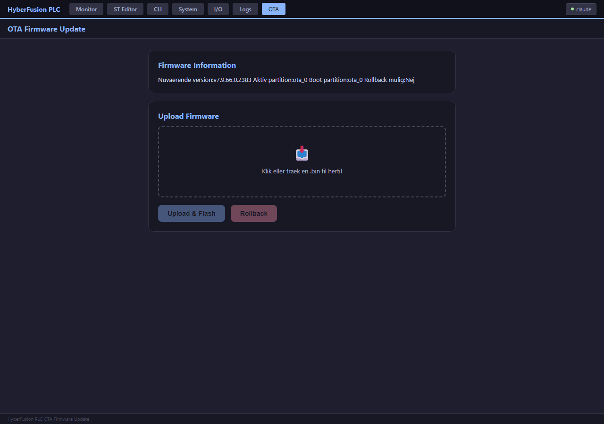

# 11. Backup, Restore & Firmware

[← 10. Sikkerhed](10_Sikkerhed_og_Adgangsstyring.md) · [Indeks](00_INDEKS.md) · Næste: [12. Netværkskonfiguration →](12_Netvaerkskonfiguration.md)

---

## 11.1 Konfigurationsbackup

Hele den persisterede konfiguration — netværk, Modbus-opsætning, RBAC-brugere, tæller-/timer-konfiguration, persist-grupper, ST Logic-programmer (inkl. GLOBAL_VAR-blokken) og bindings, Ethernet (W5500), expansion boards, analoge ind-/udgange, dashboard-layout samt watchdog-timeout/til-fra, sikker tilstand pr. udgang og watchdog pr. ST-program — kan eksporteres som én JSON-fil:

```bash
curl -u admin:modbus123 http://192.168.1.100/api/system/backup -o backup_2026-09-03.json
```

Eller fra CLI: `show backup` (viser URL'en, download foretages fra en browser/HTTP-klient).

> **Følsomt indhold:** backup-filen indeholder Wi-Fi- og telnet-adgangskoden samt expansion boards' tokens **i klartekst**. HTTP- og RBAC-adgangskoder ligger som hash + salt (BUG-352), ikke i klartekst. RBAC-brugere tages kun med, når RBAC er slået til. Opbevar backup-filer med samme forsigtighed som selve credentials — ikke i et delt, uautoriseret tilgængeligt sted. Endpointet kræver skriverettighed at hente (ikke blot læse-adgang), netop fordi indholdet er så følsomt.

## 11.2 Gendannelse (Restore)

```bash
curl -u admin:modbus123 -X POST http://192.168.1.100/api/system/restore \
     -H "Content-Type: application/json" \
     --data-binary @backup_2026-09-03.json
```

Restore overskriver den gemte konfiguration og genindlæser den. Filen må være op til 128 KB (32 KB på hardware uden PSRAM).

Sektioner der er kommet til senere (`logic_globals`, `ethernet`, `expansion_boards`, `analog`, `dashboard`, `watchdog`, `safe_outputs`, `st_watchdog` — alle fra v7.9.68.39) anvendes kun, hvis de findes i filen. En ældre backup lader derfor de nuværende værdier være. `expansion_boards` og `safe_outputs` erstatter hele listen. GLOBAL_VAR-blokken gendannes før programmerne, så de kompileres mod de rigtige globale variabler. Ethernet-, expansion- og watchdog til/fra-ændringer slår først fuldt igennem efter genstart. Systemet genstarter typisk selv (eller kræver en manuel genstart, afhængig af hvad der er ændret) for at alle ændringer slår fuldt igennem.

**Anbefalet rutine:** tag et backup **før** enhver større konfigurationsændring eller firmwareopdatering — restore er den hurtigste vej tilbage, hvis noget går galt.

## 11.3 OTA-firmwareopdatering

Firmware kan opdateres over netværket uden at skulle koble USB til igen:

1. Log ind på `/ota`-siden i webgrænsefladen (eller `POST /api/system/ota` direkte med `.bin`-filen som request-body)
2. Upload den nye `firmware.bin`
3. Enheden skriver til den inaktive OTA-partition og genstarter automatisk ind i den nye firmware
4. Går noget galt (fx firmwaren fejler ved boot), understøtter systemet **automatisk rollback** til den forrige, fungerende firmware (dual-bank OTA-partitionering)

**Størrelsesgrænse:** maks. ca. **1,8 MB** (1.900.544 bytes, svarende til én OTA-partition). Upload afvises med en tydelig fejlbesked hvis filen er for stor.



> **Adgangskontrol:** OTA-upload/rollback kræver eksplicit skriverettighed (rettet i BUG-355) — en bruger med kun læse-adgang kan ikke flashe firmware. **Stadig ingen kryptografisk firmware-signaturverifikation** — se [`../../SECURITY_INDEX.md`](../../SECURITY_INDEX.md) #2.

**Status og fremgang under upload:**
```bash
curl -u admin:modbus123 http://192.168.1.100/api/system/ota/status
```

## 11.4 Manuel rollback

Ønskes en tilbagerulning uden at afvente en fejlet boot:
```bash
curl -u admin:modbus123 -X POST http://192.168.1.100/api/system/ota/rollback
```

## 11.5 Firmwareversion

```
show version
```
viser aktuel firmwareversion, build-nummer, git-commit og target-hardware — inkludér altid dette når I rapporterer et problem eller stiller spørgsmål til supportkanalen.

---

[← 10. Sikkerhed](10_Sikkerhed_og_Adgangsstyring.md) · [Indeks](00_INDEKS.md) · Næste: [12. Netværkskonfiguration →](12_Netvaerkskonfiguration.md)
